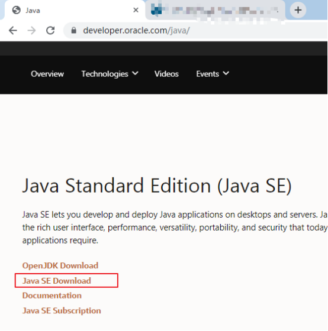
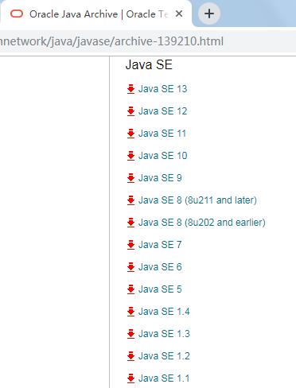
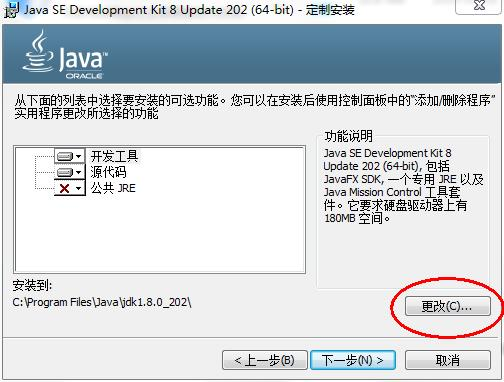
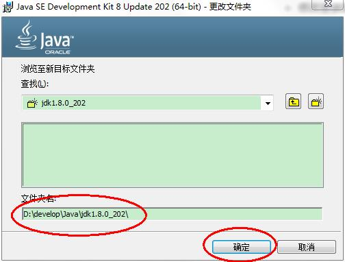
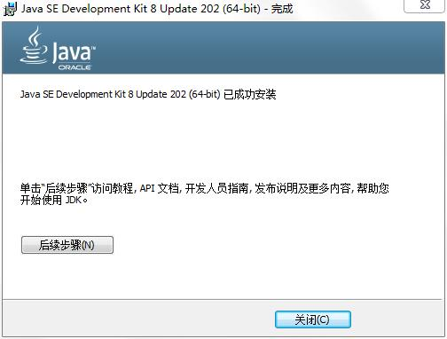
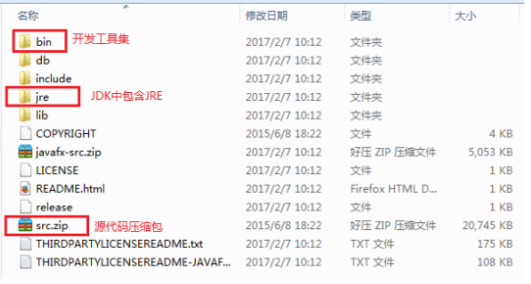
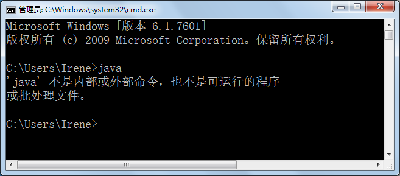
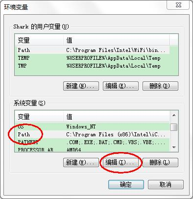

## 第1章 Java概述

## 今日内容

- Java语言的发展历史
- 安装JDK
- 配置环境变化
- 编写HelloWorld程序
- Java注释

  

## 学习目标

* [ ] 能够使用常见的DOS命令
* [ ] 理解Java语言的跨平台实现原理
* [ ] 理解JDK/JRE/JVM的组成和作用
* [ ] 能够配置环境变量JAVA_HOME（会参照笔记配置）
* [ ] 能够编写HelloWorld程序编译并执行
* [ ] 会使用单行注释和多行注释

  

# 第一章 Java概述

## 1.1 JavaSE课程体系介绍

JavaSE知识图解


JavaSE知识模块介绍

* **第一部分：计算机编程语言核心结构：**`数据类型`、`运算符`、`流程控制`、`数组`、…
* **第二部分：Java面向对象核心逻辑：**`类和对象`、`封装`、`继承`、`多态`、`抽象`、`接口`、…
* **第三部分：JavaSE核心高级应用：**`集合`、`I/O`、`多线程`、`网络编程`、`反射机制`、…
* **第四部分：Java新特性：**`Lambda表达式`、`函数式编程`、`新Date/Time API`、`接口的默认、静态和私有方法`、…
* **第五部分：MySQL/JDBC核心技术：**`SQL语句`、`数据库连接池`、`DBUtils`、`事务管理`、`批处理`、…

## 1.2 计算机语言介绍（了解）

### 计算机语言是什么

所谓计算机编程语言，就是人们可以使用编程语言对计算机下达命令，让计算机完成人们需要的功能。

### 计算机语言发展


***·第一代语言：机器语言(相当于人类的原始阶段)***

机器语言由数字组成所有指令。当让你使用数字编程，写几百个数字、甚至几千个数字，每天面对的是纯数字，我大胆预测：“程序员群体100%会有精神问题”。

机器语言通常由数字串组成（最终被简化成01），对于人类来说，机器语言过于繁琐。使用机器语言，人类无法编出复杂的程序。如下为一段典型的机器码：

\1. 0000,0000,000000010000 代表 LOAD A, 16

\2. 0000,0001,000000000001 代表 ADD    B, 1

\3. 0001,0001,000000010000 代表 STORE C, 16

 

***·第二代语言：汇编语言（相当于人类的手工业阶段）***

为了编程的方便，以及解决更加复杂的问题。程序员开始改进机器语言，使用英文缩写的助记符来表示基本的计算机操作。这些助记符构成了汇编语言的基础。如下是一些常见的汇编语言助记符(单词)比如：LOAD、MOVE之类，这样人更容易使用了。识别几百、几千个单词，感觉要比几百几千个数字，美妙多了。汇编语言相当于人类的手工业社会，需要技术极其娴熟的工匠，但是开发效率也非常低。

汇编语言虽然能编写高效率的程序，但是学习和使用都不是易事，并且很难调试。另一个复杂的问题，汇编语言以及早期的计算机语言（Basic、Fortran等）没有考虑结构化设计原则，而是使用goto语句来作为程序流程控制的主要方法。这样做的后果是：一大堆混乱的调转语句使得程序几乎不可能被读懂。对于那个时代的程序员，能读懂上个月自己写的代码都成为一种挑战。

 

***·第三代：高级语言（相当于人类的工业阶段）***

对于简单的任务，汇编语言可以胜任。但是随着计算机的发展，渗透到了工作生活的更多的方面，一些复杂的任务出现了，汇编语言就显得力不从心（应该说是程序员使用汇编语言解决复杂问题出现了瓶颈）。于是，出现了高级语言。像我们熟知的C、C++、Java等等都是高级语言。

高级语言允许程序员使用接近日常英语的指令来编写程序。例如，实现一个简单的任务：A+B=C  , 使用机器语言、汇编语言和高级语言的的实现如下图1-2所示。

|  |
| ----------------------------------- |
| ***三代计算机语言的直观对比***      |

 

***从上面这个简单的加法计算，可以看出越到高级语言，越接近人的思维，人使用起来就越方便。***

高级语言的出现，尤其是面向对象语言的出现，相当于人类的工业社会，高级语言极其易用，编程门槛和难度大大降低，大量的人员进入软件开发行业，为软件爆发性的增长提供了充足的人力资源。目前以及可预见的将来，计算机语言仍然处于“第三代高级语言”阶段。


### 计算机语言排行榜


### 计算机语言走势


## 1.3 Java语言概述（了解）

### Java生态圈

**Java是目前应用最为广泛的软件开发平台之一。**随着Java以及Java社区的不断壮大，Java 也早已不再是简简单单的一门计算机语言了，它更是一个平台、一种文化、一个社区。

**作为一个平台，**Java虚拟机扮演着举足轻重的作用。除了 Java语言，任何一种能够被编译成字节码的计算机语言都属于Java这个平台。Groovy、Scala、 JRuby、Kotlin等都是Java平台的一部分，它们依赖于Java虚拟机，同时，Java平台也因为它们变得更加丰富多彩。

**作为一种文化，**Java几乎成为了 “开源”的代名词。在Java程序中，有着数不清的开源软件和框架。如Tomcat、Struts, Hibernate, Spring等。就连JDK和JVM自身也有不少开源的实现，如OpenJDK、Apache Harmony。可以说，“共享”的精神在Java世界里体现得淋漓尽致。

**作为一个社区，**Java拥有全世界最多的技术拥护者和开源社区支持，有数不清的论坛和资料。从桌面应用软件、嵌入式开发到企业级应用、后台服务器、中间件，都可以看到Java的身影。其应用形式之复杂、参与人数之众多也令人咋舌。可以说，Java社区已经俨然成为了一个良好而庞大的生态系统。**其实这才是Java最大的优势和财富。**


### Java语言发展历史

Java诞生于SUN（Stanford University Network），09年SUN被Oracle（甲骨文）收购。

Java之父是詹姆斯.高斯林(James Gosling)。


1996年发布JDK1.0版。

目前最新的版本是Java15。我们学习的Java8。

|   发行版本   |    发行时间    |                             备注                             |
| :----------: | :------------: | :----------------------------------------------------------: |
|     oak      | 1990年代初开发 | 小家电的编程语言，来解决诸如电视机、电话、闹钟、烤面包机等家用电器的控制和通讯问题 |
|     Java     |   1995.05.23   |     Sun公司在Sun world会议上正式发布Java和HotJava浏览器      |
|   Java 1.0   |   1996.01.23   |             Sun公司发布了Java的第一个开发工具包              |
|   Java 1.1   |   1997.02.19   |                                                              |
|   Java 1.2   |   1998.12.08   |    拆分成：J2SE（标准版）、J2EE（企业版）、J2ME（小型版）    |
|   Java 1.3   |   2000.05.08   |                                                              |
|   Java1.4    |   2004.02.06   |                                                              |
| **Java 5.0** |   2004.09.30   | ①版本号从1.4直接更新至5.0；②平台更名为JavaSE、JavaEE、JavaME |
|   Java 6.0   |   2006.12.11   |               2009.04.20 Oracle宣布收购SUN公司               |
|   Java 7.0   |   2011.07.02   |                                                              |
| **Java 8.0** |   2014.03.18   |                         **LTS版本**                          |
|   Java 9.0   |   2017.09.22   |    ①每半年更新一次；②Java 9.0开始不再支持windows 32位系统    |
|  Java 10.0   |   2018.03.21   |                                                              |
|  Java 11.0   |   2018.09.25   |           ①JDK安装包取消独立JRE安装包;②**LTS版本**           |
|  Java 12.0   |   2019.03.19   |                                                              |
|  Java 13.0   |   2019.9.18    |                                                              |
|   java16.0   |     2021.3     |                           最新版本                           |

- LTS（Long Term Support）:长期支持版本，下一个LTS版本为Java 17.0

### Java技术体系平台

* JavaSE（Java Platform, Standard Edition标准版）：允许您在桌面和服务器上开发和部署Java应用程序。Java提供了丰富的用户界面、性能、多功能性、可移植性和当今应用程序所需的安全性。
* JavaEE（Java Platform, Enterprise Edition企业版）：是为开发企业环境下的应用程序提供的一套解决方案，主要针对于Web应用程序开发。
* JavaME（Java Platform, Micro Edition 小型版）：为互联网上的嵌入式和移动设备上运行的应用提供了一个健壮、灵活的环境：微控制器、传感器、网关、移动电话、个人数字助理（PDA）、电视机顶盒、打印机等等。JavaME包括灵活的用户界面、健壮的安全性、内置的网络协议，以及支持动态下载的网络和离线应用程序。基于JavaME的应用程序在许多设备上都是可移植的，但是利用了每个设备的本机功能。

  

  

  

  


## 1.4 Java语言跨平台原理

### Java语言的特点

* **完全面向对象：**Java语言支持封装、继承、多态，面向对象编程，让程序更好达到`高内聚`，`低耦合`的标准。
* **支持分布式：**Java语言支持Internet应用的开发，在基本的Java应用编程接口中有一个网络应用编程接口（java net），它提供了用于网络应用编程的类库，包括URL、URLConnection、Socket、ServerSocket等。Java的RMI（远程方法激活）机制也是开发分布式应用的重要手段。
* **健壮型：**Java的强类型机制、异常处理、垃圾的自动收集等是Java程序健壮性的重要保证。对指针的丢弃是Java的明智选择。
* **安全：**Java通常被用在网络环境中，为此，Java提供了一个安全机制以防恶意代码的攻击。如：安全防范机制（类ClassLoader），如分配不同的名字空间以防替代本地的同名类、字节代码检查。
* **跨平台性：**Java程序（后缀为java的文件）在Java平台上被编译为体系结构中立的字节码格式（后缀为class的文件），然后可以在实现这个Java平台的任何系统中运行。

### Java语言的跨平台原理

- **跨平台**：任何软件的运行，都必须要运行在操作系统之上，而我们用Java编写的软件可以运行在任何的操作系统上，这个特性称为**Java语言的跨平台特性**。该特性是由JVM实现的，我们编写的程序运行在JVM上，而JVM运行在操作系统上。
- **JVM**（Java Virtual Machine ）：Java虚拟机，简称JVM，是运行所有Java程序的假想计算机，是Java程序的运行环境之一，也是Java 最具吸引力的特性之一。我们编写的Java代码，都运行在**JVM** 之上。


如图所示，Java的虚拟机本身是不具备跨平台功能的，每个操作系统下都有不同版本的虚拟机。

- **JRE ** (Java Runtime Environment) ：是Java程序的运行时环境，包含`JVM` 和运行时所需要的`核心类库`。
- **JDK**  (Java Development Kit)：是Java程序开发工具包，包含`JRE` 和开发人员使用的工具。

我们想要运行一个已有的Java程序，那么只需安装`JRE` 即可。

我们想要开发一个全新的Java程序，那么必须安装`JDK` ，其内部包含`JRE`。


## 1.5 JDK下载和安装

### JDK的下载

* 下载网址：www.oracle.com 

* 下载步骤：

  * 登录Oracle公司官网，www.oracle.com，如图所示：在底部选择Developers开发者

    

  * 在**Developers**页面中间的技术分类部分，选择`Java`，单击进入，如图所示：

    

  * 下拉页面，找到**Java**，在此选择`JavaSEDownload`，单击进入，如图所示：

  

  * 选择Downloads选项卡，默认是最新版的Java13下载，在此处选择`Oracle JDK DOWNLOAD`，单击进入可以下载JDK13，如图所示：


选择**Accept License Agreement**，并选择对应的操作系统类型，如图所示


  * 如果要下载之前JDK版本，那么在刚才JavaSE/Download页面，下拉到最下面，找到Java Archive（Java档案馆），单击Download




例如：这里选择JavaSE 8(8U211 and later)，选择**Accept License Agreement**，并选择对应的操作系统类型。早期版本分为32位/64位操作系统区分，其中x86表示32位，x64表示64位。


### JDK的安装

* 安装步骤：

  * 双击`jdk-8u202-windows-x64.exe`文件，并单击`下一步`，如图所示：

    

  * 取消独立JRE的安装，单击`公共JRE前的下拉列表`，选择`此功能将不可用`如图所示：

    

  * 修改安装路径，单击更改，如图所示：

    

  * 将安装路径修改为`D:\develop\Java\jdk1.8.0_202\`，并单击确定，如图所示：

    

  * 单击下一步，如图所示：

    

  * 稍后几秒，安装完成，如图所示：

    

  * 目录结构，如图所示：

    

## 1.6  常用DOS命令（了解）

### 什么是DOS

Java语言的初学者，学习一些DOS命令，会非常有帮助。DOS是一个早期的操作系统，现在已经被Windows系统取代，对于我们开发人员，目前需要在DOS中完成一些事情，因此就需要掌握一些必要的命令。

Dos： Disk Operating System 磁盘操作系统, 简单说一下windows的目录结构。


### 进入DOS操作窗口

* 按下`Windows+R`键，打开运行窗口，输入`cmd`回车，进入到DOS的操作窗口。

  

* 打开DOS命令行后，看到一个路径 `C:\Users\...`  就表示我们现在操作的磁盘是C盘的Users的final目录。


### 常用命令

#### 进入目录命令：cd

（1）回到根目录

```cmd
cd /  或  cd \
```


（2）切换到上一级

```
cd ..
```


（3）当前盘的其他目录下

绝对路径：从根目录开始定位，例如：cd d:\test200\1  或者  cd d:/test200/1

例如：现在在d:/test100/hello/a目录，要切换到d:/test200/1目录


#### 切换盘符命令

（1）直接盘符:

```cmd
例如：要切换到D盘，直接d:
```

（2）使用cd命令

```cmd
例如：要切换到E盘，可以使用cd /D e:
```

使用 /D 开关，除了改变驱动器的当前目录之外，还可改变当前驱动器。


#### 查看当前目录下有什么命令：dir


####  新建目录命令：md (make directory)

```cmd
//在当前目录下创建hello文件夹
md hello

//在当前目录下创建a,b,c三个文件夹
md a b c

//在d盘test200下创建ok200文件夹
md d:\test200\ok200
```


#### 删除文件命令：del

```cmd
//删除指定文件
del 文件名.扩展名
del 目标目录\文件名.扩展名

删除所有文件并询问
del *.*

删除所有文件不询问
del /Q *.*
```


#### 删除目录命令：rd（remove directory)

```
//删除空目录
rd 空目录名

//删除目录以及下面的子目录和文件，带询问
rd /S 非空目录名

//删除目录以及下面的子目录和文件，不带询问
rd /S/Q 非空目录名
```

注意：你在d:\test100\hello\a中，你不能删除test100、hello、a这几个目录


#### 清屏命令：cls

```cmd
cls
```

#### 退出命令：exit

```java
exit
```

## 1.7 配置环境变量

为什么配置path？

希望在命令行使用javac.exe等工具时，任意目录下都可以找到这个工具所在的目录。

例如：我们在C:\Users\Irene目录下使用java命令，结果如下：



我们在JDK的安装目录的bin目录下使用java命令，结果如下：


我们不可能每次使用java.exe，javac.exe等工具的时候都进入到JDK的安装目录下，太麻烦了。我们希望在任意目录下都可以使用JDK的bin目录的开发工具，因此我们需要告诉操作系统去哪里找这些开发工具，这就需要配置path环境变量。

### 1.7.1 只配置path

* 步骤：

  * 打开桌面上的计算机，进入后在左侧找到`计算机`，单击鼠标`右键`，选择`属性`，如图所示：

    

  * 选择`高级系统设置`，如图所示：

    

  * 在`高级`选项卡，单击`环境变量`，如图所示：

    

  * 在`系统变量`中，选中`Path` 环境变量，`双击`或者`点击编辑` ,如图所示：

    

  * 在变量值的最前面，键入`D:\develop\Java\jdk1.8.0_202\bin;`  分号必须要写，而且还要是**英文符号**。如图所示：

    

  * 环境变量配置完成，**重新开启**DOS命令行，在任意目录下输入`javac` 命令，运行成功。

    


### 1.7.2 配置JAVA_HOME+path
* 步骤：

  * 打开桌面上的计算机，进入后在左侧找到`计算机`，单击鼠标`右键`，选择`属性`，如图所示：

    

  * 选择`高级系统设置`，如图所示：

    

  * 在`高级`选项卡，单击`环境变量`，如图所示：

    

  * 在`系统变量`中，单击`新建` ，创建新的环境变量，如图所示：

    

  * 变量名输入`JAVA_HOME`，变量值输入 `D:\develop\Java\jdk1.8.0_202` ，并单击`确定`，如图所示：

    

  * 选中`Path` 环境变量，`双击`或者`点击编辑` ,如图所示：

    

  * 在变量值的最前面，键入`%JAVA_HOME%\bin;`  分号必须要写，而且还要是**英文符号**。如图所示：

    

  * 环境变量配置完成，**重新开启**DOS命令行，在任意目录下输入`javac` 命令，运行成功。

    


## 1.8 入门程序HelloWorld

### 1.8.1 HelloWorld案例

#### 程序开发步骤说明

JDK安装完毕，可以开发我们第一个Java程序了。

Java程序开发三步骤：**编写**、**编译**、**运行**。


#### 编写Java源程序

1. 在`D:\atguigu\day01_code` 目录下新建文本文件，完整的文件名修改为`HelloWorld.java`，其中文件名为`HelloWorld`，后缀名必须为`.java` 。
2. 用记事本或notepad++等文本编辑器打开

3. 在文件中键入文本并保存，代码如下：

```java
public class HelloWorld {
  	public static void main(String[] args) {
    	System.out.println("HelloWorld");
  	}
}
```

> 友情提示：
>
> 每个字母和符号必须与示例代码一模一样。

第一个`HelloWord` 源程序就编写完成了，但是这个文件是程序员编写的，JVM是看不懂的，也就不能运行，因此我们必须将编写好的`Java源文件` 编译成JVM可以看懂的`字节码文件` ，也就是`.class`文件。

编译Java源文件

在DOS命令行中，**进入**`D:\atguigu\javaee\JavaSE20190624\code\day01_code`**目录**，使用`javac` 命令进行编译。

命令：

```java
javac Java源文件名.后缀名
```

举例：

```
javac HelloWorld.java
```


编译成功后，命令行没有任何提示。打开`D:\atguigu\javaee\JavaSE20190624\code\day01_code`目录，发现产生了一个新的文件 `HelloWorld.class`，该文件就是编译后的文件，是Java的可运行文件，称为**字节码文件**，有了字节码文件，就可以运行程序了。 

> Java源文件的编译工具`javac.exe`

#### 运行Java程序

在DOS命令行中，**进入Java源文件的目录**，使用`java` 命令进行运行。

命令：

```java
java 类名字
```

举例：

```
java HelloWorld
```

> 友情提示：
>
> java HelloWord  不要写 不要写 不要写 .class


> Java字节码文件的运行工具：java.exe

### 1.8.2 HelloWorld案例常见错误

* 	单词拼写问题
  * 正确：class		错误：Class
  * 正确：String              错误：string
  * 正确：System            错误：system
  * 正确：main		错误：mian
* 	Java语言是一门严格区分大小写的语言
* 	标点符号使用问题
  * 不能用中文符号，英文半角的标点符号（正确）
  * 括号问题，成对出现

### 1.8.3 Java程序的结构与格式

结构：

```java
类{
    方法{
        语句;
    }
}
```

格式：

（1）每一级缩进一个Tab键

（2）{}的左半部分在行尾，右半部分单独一行，与和它成对的"{"的行首对齐

### 1.8.4 Java程序的入口

Java程序的入口是main方法

```java
public static void main(String[] args){
    
}
```

### 1.8.5 编写Java程序时应该注意的问题

1、字符编码问题

当cmd命令行窗口的字符编码与.java源文件的字符编码不一致，如何解决？


解决方案一：

	在Notepad++等编辑器中，修改源文件的字符编码


解决方案二：

	在使用javac命令式，可以指定源文件的字符编码

```cmd
javac -encoding utf-8 Review01.java
```


2、大小写问题

（1）源文件名：

	不区分大小写，我们建议大家还是区分

（2）字节码文件名与类名

	区分大小写

（3）代码中

	区分大小写


3、源文件名与类名一致问题？

（1）源文件名是否必须与类名一致？public呢？

如果这个类不是public，那么源文件名可以和类名不一致。

如果这个类是public，那么要求源文件名必须与类名一致。

我们建议大家，不管是否是public，都与源文件名保持一致，而且一个源文件尽量只写一个类，目的是为了好维护。


（2）一个源文件中是否可以有多个类？public呢？

一个源文件中可以有多个类，编译后会生成多个.class字节码文件。

但是一个源文件只能有一个public的类。


（3）main必须在public的类中吗？

不是。

但是后面写代码时，基本上main习惯上都在public类中。

