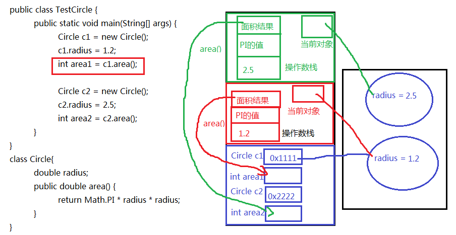
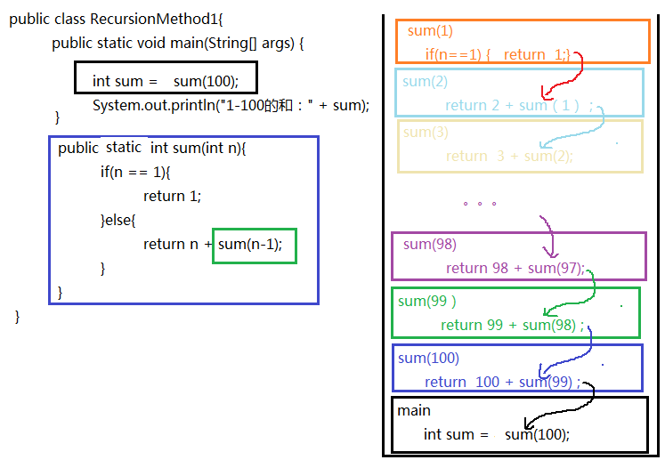
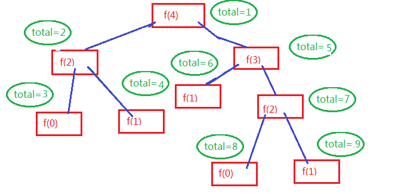
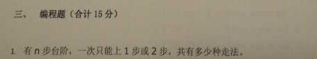

# 第5章 面向对象基础（上） 

## 学习目标

- [ ] 初步了解面向对象的思想
- [ ] 能够明确类与对象关系
- [ ] 能够掌握类的定义格式
- [ ] 能够掌握创建对象格式
- [ ] 理解包的作用
- [ ] 掌握包的声明和导入
- [ ] 能够通过类访问类的静态成员变量和静态成员方法
- [ ] 能够通过对象访问对象的非静态成员变量和非静态成员方法
- [ ] 能够区别静态方法和非静态方法
- [ ] 能够区别类变量与实例变量
- [ ] 能够区别成员变量与局部变量
- [ ] 能够理解方法的调用执行机制
- [ ] 能够理解方法的参数传递机制
- [ ] 掌握方法的可变参数的使用
- [ ] 掌握方法重载的概念
- [ ] 能够判断出方法的重载
- [ ] 了解命令行参数
- [ ] 理解递归方法
- [ ] 理解对象数组


# 第五章 面向对象基础（上）

## 5.1 面向对象思想概述

### 5.1.1 概述

Java语言是一种面向对象的程序设计语言，而面向对象思想（OOP）是一种程序设计思想，我们在面向对象思想的指引下，使用Java语言去设计、开发计算机程序。
这里的**对象**泛指现实中一切事物，每种事物都具备自己的**属性**和**行为**。面向对象思想就是在计算机程序设计过程中，参照现实中事物，将事物的属性特征、行为特征抽象出来，描述成计算机事件的设计思想。
它区别于面向过程思想（POP），强调的是通过调用对象的行为来实现功能，而不是自己一步一步的去操作实现。

### 5.1.2 面向对象与面向过程的区别

1. **面向过程**：POP: Process-Oriented Programming

   以函数（方法）为最小单位

   数据独立于函数之外

   面向功能划分软件结构

   以过程，步骤为主，考虑怎么做

   程序员是具体执行者

   制约了软件的可维护性和可扩展性

   

2. **面向对象**：OOP: Object Oriented Programming

   以类/对象为最小单位，类包括：数据+方法

   把软件系统看成各种对象的集合

   以对象（谁）为主，考虑谁来做，谁能做

   程序员是指挥者

   面向对象仍然包含面向过程，只不过关注点变了，关注谁来做

   软件可重用性、可维护性和可扩展性强。比如
   
   **面向对象思想思考“如何设计车”：**
   
    
   
    
   
    
   
    **天然的，我们就会从“车由什么组成”开始思考。  发现 ，车由如下对象组成 ：** 
   
    
   
   
   
    
   
   
   
   为了便于协作，我们找轮胎厂完成制造轮胎的步骤，发动机厂完成制造发动机的步骤；这样，发现大家可以同时进行车的制造，最终进行组装，大大提高了效率。但是，具体到轮胎厂的一个流水线操作，仍然是有步骤的，还是离不开执行者、离不开面向过程思维！
   
    
   
   ​	因此， 面向对象可以帮助我们从宏观上把握、从整体上分析整个系统。  但是，具体到实现部分的微观操作（就是一个个方法），仍然需要面向过程的思路去处理。
   
    
   
   ​	我们千万不要把面向过程和面向对象对立起来。他们是相辅相成的。面向对象离不开面向过程！

### 5.1.3 面向对象的三大特征

面向对象的语言中，包含了三大基本特征，即：

- **封装(Encapsulation）**
- **继承(Inheritance) **
- **多态(Polymorphism) **

## 5.2 类和对象

### 5.2.1 类与对象的概念及关系

**万物皆对象**，环顾周围，你会发现很多对象，比如桌子，椅子，同学，老师，顾客，收银员等。

描述身边的对象：


如何描述对象？

**对象的属性**：姓名，年龄，体重，员工编号，部门等对象的静态特征

**对象的行为**：购买商品，收款，打印账单等对象的动态特征或行为特征或者功能

1. **什么是对象？**

   - **对象**：是一个具有特定属性和行为特征的具体事物。

2. **什么是类？**

   - **类**：是一类具有相同特征的事物的抽象描述，是一组相同**属性**和**行为**的对象的集合。

3. **类与对象的关系**

   - 类是对一类事物的描述，是**抽象的**。
   - 对象是一类事物的实例，是**具体的**。
   - **类是对象的模板，对象是类的实体**。

   ```markdown
   上例中的类和对象：
   **顾客**是一类事物的抽象描述，即为类，他们都有姓名，年龄，体重这些属性特征和购买商品的行为特征；
   **张三**是一个具体的顾客，即为对象。
   **收银员**是另一类事物的抽象描述，他们都有员工号，姓名、部门这些属性特征和收款、打印账单的行为特征；
   **李四**是一个具体的收银员。
   ```

举例描述类和对象：

* ***英雄联盟、王者荣耀中的类和对象***

  

  英雄就是类，具体的英雄，盖伦、提莫是对象。

  ***示例2：***

  ***月饼模具和月饼***

  月饼模具是类，使用月饼模具制作的一个个月饼就是对象

  


### 5.2.2 类的定义

Java中类的定义，就是把现实中类的概念用Java语言描述。

Java中用**class**关键字定义一个类，并定义类的成员：成员变量（属性）和成员方法（行为）。

**类的定义格式**

```java
public class 类名 {
  //成员变量，描述这类事物的属性
  //成员方法，描述这类事物的行为
}
```

* **成员变量**：和以前定义变量几乎是一样的。只不过位置发生了改变。**在类中，方法外**，用于描述对象的属性特征。
* **成员方法**：和以前写的main方法格式类似。只不过功能和形式更丰富了。在类中，方法外，用于描述对象的行为特征。

定义类的代码举例：

```java
//定义顾客类
public class Customer {
  	//成员变量,描述属性特征
  	String name;//姓名
    int age;//年龄
    int weight;//体重
    
    //成员方法，描述行为特征
    public void shopping(){
        System.out.println("购物...");
    }
}
```

**练习：**

​	定义学生类，汽车类

### 5.2.3 对象的创建与使用

类是对象的模板，所以通过类创建这个类的对象，或者说创建这个类的一个实例，这个过程称为类的实例化：

- **创建对象语法格式：** 

  **类名 对象名= new 类名 ();**

  ```java
  //创建顾客对象
  Customer c=new Customer();
  ```

- **使用对象的成员，使用“. ”操作**：

  使用成员变量：**对象名.属性**
  使用成员方法：**对象名.方法名()**

  ```java
  c.name="张三"; //访问对象的属性，赋值
  c.age=18;
  System.out.println(c.name+"--"+c.age); //访问对象的属性，获取值
  c.shopping(); //访问对象的方法
  ```


**练习：**

​	定义手机类并创建对象再使用

### 5.2.4对象的内存分析

​	**JVM内存结构图：**


| 区域名称   | 作用                                                         |
| ---------- | ------------------------------------------------------------ |
| **栈**     | 虚拟机栈，用于存储正在执行的每个Java方法的局部变量表等。局部变量表存放了编译期可知长度的各种基本数据类型、对象引用，方法执行完，自动释放。 |
| **堆**     | 存储对象（包括数组对象），new来创建的，都存储在堆内存。      |
| **方法区** | 存储已被虚拟机加载的类信息、常量、静态变量、即时编译器编译后的代码等数据。 |
| 程序计数器 | 程序计数器是CPU中的寄存器，它包含每一个线程下一条要执行的指令的地址 |
| 本地方法栈 | 当程序中调用了native的本地方法时，本地方法执行期间的内存区域 |


**对象名中存储的是什么呢？答：对象地址**

```java
class Student{
    
}
public class TestStudent{
    //Java程序的入口
    public static void main(String[] args){
        System.out.println(new Student());//Student@7852e922

        Student stu = new Student();
        System.out.println(stu);//Student@4e25154f
        
        int[] arr = new int[5];
		System.out.println(arr);//[I@70dea4e
    }
}
//Student和TestStudent没有位置要求，谁在上面谁在下面都可以
//但是如果TestStudent类的main中使用了Student类，那么要求编译时，这个Student已经写好了，不写是不行的
//如果两个类都在一个.java源文件中，只能有一个类是public的
```

发现学生对象和数组对象类似，直接打印对象名和数组名都是显示“类型@对象的hashCode值"，所以说类、数组都是引用数据类型，引用数据类型的变量中存储的是对象的地址，或者说指向堆中对象的首地址。

那么像“Student@4e25154f”是对象的地址吗？不是，因为Java是对程序员隐藏内存地址的，不暴露内存地址信息，所以打印对象时不直接显示内存地址，而是JVM提取了对象描述信息给你现在，默认提取的是对象的运行时类型@代表对象唯一编码的hashCode值。


## 5.3 包（Package）

### 5.3.1 包的作用

（1）可以避免类重名：有了包之后，类的全名称就变为：包.类名

（2）分类组织管理众多的类

例如：

* java.lang----包含一些Java语言的核心类，如String、Math、Integer、 System和Thread等，提供常用功能
* java.net----包含执行与网络相关的操作的类和接口。
* java.io ----包含能提供多种输入/输出功能的类。
* java.util----包含一些实用工具类，如集合框架类、日期时间、数组工具类Arrays，文本扫描仪Scanner，随机值产生工具Random。
* java.text----包含了一些java格式化相关的类
* java.sql和javax.sql----包含了java进行JDBC数据库编程的相关类/接口
* java.awt和java.swing----包含了构成抽象窗口工具集（abstract window toolkits）的多个类，这些类被用来构建和管理应用程序的图形用户界面(GUI)。

（3）可以控制某些类型或成员的可见范围

如果某个类型或者成员的权限修饰缺省的话，那么就仅限于本包使用

### 5.3.2 声明包的语法格式

```java
package 包名;
```

> 注意：
>
> (1)必须在源文件的代码首行
>
> (2)一个源文件只能有一个声明包的语句

包的命名规范和习惯：
（1）所有单词都小写，每一个单词之间使用.分割
（2）习惯用公司的域名倒置

例如：com.atguigu.xxx;

> 建议大家取包名时不要使用“java.xx"包

### 5.3.3 如何跨包使用类

前提：被使用的类或成员的权限修饰符是>缺省的，即可见的

（1）使用类型的全名称

例如：java.util.Scanner input = new java.util.Scanner(System.in);

（2）使用import 语句之后，代码中使用简名称

import语句告诉编译器到哪里去寻找类。

import语句的语法格式：

```java
import 包.类名;
import 包.*;
import static 包.类名.静态成员; //后面再讲
```

> 注意：
>
> 使用java.lang包下的类，不需要import语句，就直接可以使用简名称
>
> import语句必须在package下面，class的上面
>
> 当使用两个不同包的同名类时，例如：java.util.Date和java.sql.Date。一个使用全名称（全路径名），一个使用简名称

示例代码：

```java
package com.atguigu.bean;

public class Student {
	// 成员变量
	private String name;
	private int age;

	// 构造方法
	public Student() {
	}

	public Student(String name, int age) {
		this.name = name;
		this.age = age;
	}

	// 成员方法
	public void setName(String name) {
		this.name = name;
	}

	public String getName() {
		return name;
	}

	public void setAge(int age) {
		this.age = age;
	}

	public int getAge() {
		return age;
	}
}
```

```java
package com.atguigu.test;

import java.util.Scanner;
import java.util.Date;
import com.atguigu.bean.Student;

public class Test{
    public static void main(String[] args){
        Scanner input = new Scanner(System.in);
        Student stu = new Student();
        String str = "hello";
        
        Date now = new Date();
        java.sql.Date d = new java.sql.Date(346724566);        
    }
}
```

## 5.4 成员变量

### 5.4.1 变量的分类

根据定义位置不同分为：

- **局部变量：**定义在方法体内或其他局部区域内的变量（之前所使用的都是main方法中定义的变量，为局部变量）。

- **成员变量：**定义在类的成员位置，在方法体外，与方法（例如main方法）平行的位置。并且有修饰符修饰。

  根据修饰的不同成员变量又分为：

  - **类变量：**或叫**静态变量**，有static修饰的成员变量。（上例中的country为类变量）
  - **实例变量：**没有static修饰的成员变量。

### 5.4.2 成员变量的声明

语法格式：

```java
class 类名{
    【修饰符】 数据类型  属性名;    //属性有默认值
    【修饰符】 数据类型  属性名 = 值; //属性有初始值
}
```

> 说明：常用修饰符有public、缺省、private、protected、final、static
>
> 数据类型可以是任意基本数据类型和引用数据类型。
>
> 属性名即变量名，符合标识符的命名规则和规范。

举例：

```java
//定义一个中国人类
class Chinese{
    public static String country;
	public String name;
    char gender = '男';//显式赋值
    private int age;
}
```

### 5.4.3 成员变量的访问

- 实例变量的访问：

  - 对象名.静态成员变量  

- 类变量的访问：

  - 类名.静态成员变量 

  - 对象名.静态成员变量（不推荐）

示例：

```java
public class TestChinese {
	public static void main(String[] args) {
		//类名.静态成员变量
		System.out.println(Chinese.country);
		//错误，非静态成员变量必须通过对象.进行访问
//		System.out.println(Chinese.name);
		
		Chinese c1 = new Chinese();
		//对象名.非静态成员变量
		System.out.println(c1.name);
		//静态的成员变量也可以通过对象.进行访问
		//对象名.非静态成员变量
		System.out.println(c1.country);
        System.out.println(c1.gender);
	}
}
class Chinese{
	static String country;
	String name;
    char gender = '男';
}
```

### 5.4.4 普通成员变量的内存图

1. **成员变量有默认初始值**（同数组元素默认初始值）

   |         数据类型         |       默认值        |
   | :----------------------: | :-----------------: |
   |  byte，short，int，long  |          0          |
   |      float，double       |         0.0         |
   |           char           | 0或'\u0000'表现为空 |
   |         boolean          |        false        |
   | 数组，类，接口等引用类型 |        null         |

2. **实例变量的值是每个对象独立的**

   ```java
   public class TestCat {
       public static void main(String[] args) {
           //创建对象 类名 对象名 = new 类名();
           Cat cat= new Cat();
           System.out.println("名字是："+cat.name+",颜色是："+cat.color+",年龄是："+cat.age+",品种是："+cat.type);
           
           Cat c1 = new Cat();
           c1.name="小黑猫";
           c1.age=3;
           c1.type="蓝猫";
           c1.color="黑色";
           System.out.println("名字是："+c1.name+",颜色是："+c1.color+",年龄是："+c1.age+",品种是："+c1.type);
   
       }
   }
   public class Cat {
       String name;
       String color;
       int age;
       String type;
   }
   ```


### 5.4.5 静态成员变量的内存分析

从内存分析看类变量与实例变量如何呈现的以上特点。

```java
class Test08FieldSave{
	public static void main(String[] args){
		Chinese c1 = new Chinese();
        Chinese c2 = new Chinese();
		c1.name = "张三";
		c2.name = "李四";
		System.out.println(c1.country+“--”+c1.name);
        System.out.println(c2.country+“--”+c2.name);
		System.out.println("-------------------------");
		//修改类变量值
		c1.country = "中华人民共和国";
        //修改实例变量
        c1.name="张三丰";
		System.out.println(c1.country+“--”+c1.name);
        System.out.println(c2.country+“--”+c2.name);
		System.out.println(Chinese.country);
	}
}

class Chinese{
	static String country = "中国";
	String name;
}
```


### 5.4.6  小结:成员变量与局部变量的区别

|                  | **成员变量**                     | **局部变量**                                                 |
| ---------------- | -------------------------------- | ------------------------------------------------------------ |
| **声明的位置**   | 直接声明在类的成员位置           | 声明在方法体中或其他局部区域内（方法声明上，构造方法，代码块等） |
| **修饰符**       | public、private、static、final等 | 不能使用访问权限修饰符，可以使用final                        |
| **内存加载位置** | 堆或方法区（static修饰时）       | 栈                                                           |
| **初始化值**     | 有默认初始化值                   | 无默认初始化值                                               |
| **生命周期**     | 同对象或类（static时）的生命周期 | 随着方法的调用而存在，方法调用完毕即消失                     |

### 练习题

（1）声明一个圆的图形类，有属性：半径
	在测试类的main中，创建圆的2个对象，为半径属性赋值，并显示两个圆的半径值和面积值
	提示：圆周率为Math.PI

（2）声明一个银行账户类，有属性：利率、账号、余额

​	在测试类的main中，创建账户类的两个对象，其中所有账户的利率是相同的，都是0.035，而账号和余额是不同的，并打印显示

（3）声明一个MyDate类型，有属性：年，月，日

​		  声明另一个Employee类型，有属性：姓名（String类型），生日（MyDate类型）

在测试类中的main中，创建两个员工对象，并为他们的姓名和生日赋值，并显示


## 5.5 方法

**成员变量是用来存储对象的数据信息的，那么如何表示对象的行为功能呢？就要通过方法来实现**

### **5.5.1 方法的概念**

**方法也叫函数，是一个独立功能的定义，是一个类中最基本的功能单元。**

**把一个功能封装为方法的目的是，可以实现代码重用，从而简少代码量。**

### **5.5.2 成员方法的分类**

根据修饰不同方法主要分为两类：

* **实例方法：**没有static修饰的方法，必须通过实例对象来调用。
* **静态方法：**有static修饰的方法，也叫类方法，主要特点是可以由类名来调用。

### 5.5.3 方法的声明与调用

####   5.5.3.1声明

1. **方法声明的位置必须在类中方法外**

2. **语法格式**

   ```java
   【修饰符】 返回值类型 方法名(【参数列表：参数类型1 参数名1,参数类型2 参数名, ...... 】){
           方法体；
           【return 返回值;】
   }
   ```

3. **格式说明**：

   - **修饰符：** 修饰符后面详细讲，例如：public，static等都是修饰符

   - **返回值类型：** 表示方法运行的结果的数据类型，与**”return 返回值“**搭配使用

     - 无返回值：void
     - 有返回值：可以是任意基本数据类型和引用数据类型

   - **方法名：**给方法起一个名字，要符合标识符的命名规则，尽量见名知意，能准确代表该方法功能的名字

   - **参数列表：**方法内部需要用到其他方法中的数据，需要通过参数传递的形式将数据传递过来，可以是基本数据类型、引用数据类型、也可以没有参数，什么都不写

   - **方法体：**特定功能的代码

   - **return：**结束方法，可以返回方法的运行结果

     - 可以返回不同类型的数据，对应匹配的**返回值类型**。

     - 如果方法无返回值，可以省去return，并且返回值类型为**void**

     **简单示例：**

     ```java
     public class Person {
         
         public void hello(){
             System.out.println("hello world");
         }
     }
     ```

   


####   5.5.3.2调用

方法必须先声明后使用，不调用不执行，调用一次执行一次。

```java
public class TestMethod1 {

  //方法的声明1
    public static void develop(){
        System.out.println("发育路开始执行 ");
    }
    //jvm
    public static void main(String[] args) {
        System.out.println("水晶出发");
        //方法调用
        compete();
        //方法调用
        develop();
        System.out.println("中路开始执行");
    }
    //方法的声明2
    public static void compete(){
        System.out.println("对抗路 开始执行");
    }
 }
```

#### 注意：

```java
    1.方法只声明 不调用 不会执行的
    2.方法的执行顺序只与调用顺序有关
    3.方法与方法是兄弟关系
    4.方法执行结束会回到方法调用处
```

### 5.5.4形参与实参

```java
public class TestMethod2 {
    //方法的声明
    public static void show(double d){//形参
        System.out.println("this is show() "+ d);
    }
    public static void main(String[] args) {
        show(3.14);//实参
        show(30);
        System.out.println("---------------------------");
        sum(10, 20);
    }
    //方法的声明
    public static void sum(int c,int d){//形参
        System.out.println("和是："+(c+d));
    }
}
```


3. **形参与实参的概念理解**
- **形参：**在定义方法时方法名后面括号中声明的变量称为形式参数（简称形参）即形参出现在方法定义时。
  
- **实参：**调用方法时方法名后面括号中的使用的值/变量/表达式称为实际参数（简称实参）即实参出现在方法调用时。
4. **方法调用的注意事项**
- 调用方法时，实参的个数、类型、顺序必须要与形参列表一一对应
  

### 5.5.5返回值类型

```java
方法的组成：
     [修饰符]       返回值类型  方法名(形参列表){ }
    public static   void    main([String[] args]){
        
    }
  
```

​    **void:**:代表当前方法 不返回任何内容
​    **数据类型:** 必须返回一个该类型匹配的值
​    **int：**代表当前方法【必须】返回一个int值

**判断一个数是不是偶数**

```java
public class TestMethod3 {
    //
    public static boolean isEven(int num){
       /* if(num%2==0){
            return true;
        }
        return false;*/
       return num%2==0;
    }
    public static void main(String[] args) {
        //将方法执行的结果赋值给一个局部变量
        boolean isEven = isEven(10);
        System.out.println("ouShu = " + isEven);
        //直接输出方法的执行结果
        System.out.println("isEven(89) = " + isEven(89));
    }
}
```

**练习：定义方法判断是否为素数，是返回true,不是返回false**

```java
public class TestMethod4 {
    public static boolean isPrimeNum(int num){
        for (int i = 2; i <num ; i++) {
            if(num%i==0){
                return false;
            }
        }
        return true;
    }
    public static void main(String[] args) {
        //将方法执行的结果赋值给局部变量
        boolean primeNum = isPrimeNum(9);
        System.out.println("primeNum = " + primeNum);
        //直接输出方法的执行结果
        System.out.println("isZhiShu(11) = " + isPrimeNum(10));
    }
}
```


### 5.5.6 实例方法与静态方法的区别

```java
方法的声明：
    静态方法： 有static关键字的方法
    非静态方法：没有static关键字的方法
调用方式：
	静态方法 参考静态变量 类名.方法名();
	非静态方法：参考实例变量  对象名.方法名();
    注： 在本类中 可以省略类名/对象名调用
资源引用问题：
	静态方法： 只能【直接】调用静态资源
	非静态方法：可以直接调用所有的资源
	
```


```java
class Circle{
	double radius;
	
	//写一个方法，可以返回“圆对象”的详细信息
	String getDetailInfo(){
		return "半径：" + radius + "，面积：" + area() +"，周长：" + perimeter();
	}
	
	//写一个方法，可以返回“圆对象”的面积
	double area(){
		return Math.PI*radius*radius;
	}
	
	//写一个方法，可以返回“圆对象”的周长
	double perimeter(){
		return 2*Math.PI*radius;
	}

}
```

```java
class Test{
		
	static void test(){
		System.out.println("");
	}
	void method(){
		 test();
	}
    
    public static void main(String[] args){
        method();//错误 静态方法不能直接调用非静态资源
        test();//正确
    }
}
```

### 5.5.6 方法的声明与调用练习

1. **声明数学工具类MathTools**

   （1）静态方法1：可以比较两个整数是否相同
   （2）静态方法2：可以判断某个数是否是素数
   （3）静态方法3：可以返回某个整数所有的约数（约数：从1到这个数之间所有能把它整除的数）
   在Test测试类的main中调用测试

2. **声明数组工具类ArraysTools**

   （1）静态方法1：可以实现给任意整型数组实现从小到大排序
   （2）静态方法2：可以遍历任意整型数组，返回结果效果：[元素1，元素2，元素3。。。]

3. **声明矩形类**

   （1）包含属性：长、宽

   （2）包含3个方法：

   1. 求面积、
   2. 求周长、
   3. 返回矩形对象的信息：长：xx，宽：xx，面积：xx，周长：xx

4. **声明一个圆类，有半径radius成员变量**

   1. 声明一个图形工具类GraphicTools，包含一个静态方法可以返回两个圆中面积大的那一个圆的方法
   2. 在测试类中测试

### 5.5.7 方法调用内存分析

**方法不调用不执行，调用一次执行一次，每次调用会在栈中有一个入栈动作，即给当前方法开辟一块独立的内存区域，用于存储当前方法的局部变量的值，当方法执行结束后，会释放该内存，称为出栈，如果方法有返回值，就会把结果返回调用处，如果没有返回值，就直接结束，回到调用处继续执行下一条指令。**

**栈结构特点：先进后出，后进先出。**

1. **示例一：**

   ```java
   public class TestCount {
   	public static void main(String[] args) {
           int a = 4;
           int b = 2;
   		int m = CountTools.max(a, b));
   	}
   }
   class CountTools{
   	static int max(int a, int b) {
   		return a > b ? a : b;
   	}
   }
   ```

   ****

   

2. **示例二：**

   ```java
   public class TestCircle {
   	public static void main(String[] args) {
   		Circle c1 = new Circle();
   		c1.radius = 1.2;
   		int area1 = c1.area();
   		
   		Circle c2 = new Circle();
   		c2.radius = 2.5;
   		int area2 = c2.area();
   	}
   }
   class Circle{
   	double radius;
   	public double area() {
   		return Math.PI * radius * radius;
   	}
   }
   ```

   ****

   

3. **示例三：**

   ```java
   public class Test {
   	public static void main(String[] args) {
   		int[] arr = {2,4,1,5,3};
   		
   		ArrayUtil.sort(arr);
   		
   		for (int i = 0; i < arr.length; i++) {
   			System.out.println(arr[i]);
   		}
   	}
   }
   class ArrayUtil{
   	public static void sort(int[] arr){
   		for (int i = 1; i < arr.length; i++) {
   			for (int j = 0; j < arr.length - i; j++) {
   				if(arr[j] > arr[j+1]){
   					int temp = arr[j];
   					arr[j] = arr[j+1];
   					arr[j+1] = temp;
   				}
   			}
   		}
   	}
   }
   ```

   ****

   

## 5.6 方法参数的值传递机制

* **方法的参数传递机制：实参给形参赋值**
  * **方法的形参是基本数据类型时，形参值的改变不会影响实参；**
  * **方法的形参是引用数据类型时，形参地址值的改变不会影响实参，但是形参地址值里面的数据的改变会影响实参，例如，修改数组元素的值，或修改对象的属性值。**
    * **注意：String、Integer等特殊类型容易错**

**示例代码1：**

```java
class Test{
    public static void swap(int a, int b){
        int temp = a;
        a = b;
        b = temp;
	}

	public static void main（String[] args){
        int x = 1;
        int y = 2;
        swap(x,y);//调用完之后，x与y的值不变
    }
}

```

**示例代码2：**

```java
class Test{
    public static void change(MyData my){
        my.num *= 2;
    }
    
    public static void main(String[] args){
        MyData m = new MyData();
        m.num = 1;
        
        change(m);//调用完之后，m对象的num属性值就变为2
    }
}

class MyData{
    int num;
}
```

**示例代码3：**

```java
public class Test {
	public static void main(String[] args) {
		int[] arr = {2,4,1,5,3};
		
		ArrayUtil.sort(arr);
		
		for (int i = 0; i < arr.length; i++) {
			System.out.println(arr[i]);
		}
	}
}
class ArrayUtil{
	public static void sort(int[] arr){
		for (int i = 1; i < arr.length; i++) {
			for (int j = 0; j < arr.length - i; j++) {
				if(arr[j] > arr[j+1]){
					int temp = arr[j];
					arr[j] = arr[j+1];
					arr[j+1] = temp;
				}
			}
		}
	}
}
```

**陷阱1：**

```java
/*
陷阱1：在方法中，形参 = 新new对象，那么就和实参无关了
*/
class Test{
    public static void change(MyData my){
        my = new MyData();//形参指向了新对象
        my.num *= 2;
    }
    
    public static void main(String[] args){
        MyData m = new MyData();
        m.num = 1;
        
        change(m);//调用完之后，m对象的num属性值仍然为1
    }
}

class MyData{
    int num;
}
```

**陷阱2：见字符串和包装类部分**

```java
public class Test {
	public static void main(String[] args) {
		StringUtil util = new StringUtil();
		String str = "尚硅谷";
		util.change(str);
		System.out.println(str);//
	}
}
class StringUtil{
	public void change(String str){
		str += "你好";//String对象不可变，一旦修改就会产生新对象
	}
}
```


## **5.7 方法重载**

**方法重载：指在同一个类中，允许存在一个以上的同名方法，只要它们的参数列表不同即可，与修饰符和返回值类型无关。**

**参数列表不同：指的是参数个数不同，数据类型不同，数据类型顺序不同。**


1. **示例一：比较两个数据是否相等**

   **比较两个数据是否相等。参数类型分别为两个`byte`类型，两个`short`类型，两个`int`类型，两个`long`类型，并在`main`方法中进行测试。** 

   ```java
   public class Method_Demo6 {
       public static void main(String[] args) {
           //定义不同数据类型的变量
           byte a = 10;
           byte b = 20;
           short c = 10;
           short d = 20;
           int e = 10;
           int f = 10;
           long g = 10;
           long h = 20;
           // 调用
           System.out.println(compare(a, b));
           System.out.println(compare(c, d));
           System.out.println(compare(e, f));
           System.out.println(compare(g, h));
       }
       // 两个byte类型的
       public static boolean compare(byte a, byte b) {
           System.out.println("byte");
           return a == b;
       }
   
       // 两个short类型的
       public static boolean compare(short a, short b) {
           System.out.println("short");
           return a == b;
       }
   
       // 两个int类型的
       public static boolean compare(int a, int b) {
           System.out.println("int");
           return a == b;
       }
   
       // 两个long类型的
       public static boolean compare(long a, long b) {
           System.out.println("long");
           return a == b;
       }
   }
   ```

2. **示例二：求各种最大值**

   **用重载实现：**
   **定义方法求两个整数的最大值**
   **定义方法求三个整数的最大值**
   **定义方法求两个小数的最大值**

   ```java
   //求两个整数的最大值
   public int max(int a,int b){
       return a>b?a:b;
   }
   	
   //求三个整数的最大值
   public int max(int a, int b, int c){
       return max(max(a,b),c);
   }
   	
   //求两个小数的最大值
   public double max(double a, double b){
       return a>b?a:b;
   }
   ```

3. **示例三：判断两个方法是否是合理的重载方法**

   ```java
   //判断如下两个方法是否构成重载：是
   class StringUtil{
   	public static String concat(char seperator, String... args){
   		String str = "";
   		for (int i = 0; i < args.length; i++) {
   			if(i==0){
   				str += args[i];
   			}else{
   				str += seperator + args[i];
   			}
   		}
   		return str;
   	}
   	public static String concat(String[] args){
   		String str = "";
   		for (int i = 0; i < args.length; i++) {
   			str += args[i];
   		}
   		return str;
   	}
   }
   ```

   ```java
   //判断如下两个方法是否构成重载：不是
   class Count{
   	public static int getSum(int... nums){
   		int sum = 0;
   		for (int i = 0; i < nums.length; i++) {
   			sum += nums[i];
   		}
   		return sum;
   	}
   	public static int getSum(int[] nums){
   		int sum = 0;
   		for (int i = 0; i < nums.length; i++) {
   			sum += nums[i];
   		}
   		return sum;
   	}
   }
   ```

   ```java
   class Test06_Overload_Problem2{
   	public static void main(String[] args){
   		System.out.println(sum(1,2));//(int a, int b)
   		System.out.println(sum(1,2,3));//(int... args)和(int a, int... args)都兼容，就有问题
   	}
   
   	//不调用编译没问题，但是调用时就有问题
   	public static int sum(int a, int b){
   		return a+b;
   	}
   	public static int sum(int... args){
   		int sum = 0;
   		for(int i=0; i<args.length; i++){
   			sum += args[i];
   		}
   		return sum;
   	}
   	public static int sum(int a, int... args){
   		int sum = a;
   		for(int i=0; i<args.length; i++){
   			sum += args[i];
   		}
   		return sum;
   	}	
   }
   ```

   #### **课后练习**

   1、声明一个数组工具类ArraysTools，包含几个重载方法

   （1）重载方法系列1：可以为byte[]，short[]，int[]，long[]，double[]，char[]数组实现从小到大排序

   （2）重载方法系列2：可以遍历byte[]，short[]，int[]，long[]，double[]，char[]数组，遍历结果形式：

   ​		[元素1，元素2，。。。]

   2、声明一个图形工具类GraphicTools，包含两个重载方法

   （1）包含方法1：根据底边和高，求三角形面积，
   （2）包含方法2：根据三条边，求三角形面积

   提示：根据三角形三边求面积的海伦公式： 

   ****

## **5.8  可变参数**

**在JDK1.5之后，如果我们定义一个方法时，此时某个形参的类型可以确定，但是形参的个数不确定，那么我们可以使用可变参数。**

**格式：**

```
【修饰符】 返回值类型 方法名(【非可变参数部分的形参列表,】参数类型... 形参名){  }
```

注意：

（1）一个方法最多只能有一个可变参数

（2）如果一个方法包含可变参数，那么可变参数必须是形参列表的最后一个

1. **示例一：    求n个整数的和**

   ```java
   public class ChangeArgs {
   	public static void main(String[] args) {
   		int[] arr = { 1, 4, 62, 431, 2 };
   		int sum1 = getSum1(arr);
   		System.out.println(sum1);
   
   		int sum2 = getSum2(arr);
   		System.out.println(sum2);
   		int sum3 = getSum2(1, 4, 62, 431, 2);
   		System.out.println(sum3);
   	}
   
   	// 完成数组 所有元素的求和
   	// 原始写法
   	public static int getSum1(int[] arr) {
   		int sum = 0;
   		for (int i = 0; i < arr.length; i++) {
   			sum += arr[i];
   		}
   
   		return sum;
   	}
   
   	// 可变参数写法
   	public static int getSum2(int... arr) {
   		int sum = 0;
   		for (int i = 0; i < arr.length; i++) {
   			sum += arr[i];
   		}
   		return sum;
   	}
   }
   ```

2. **示例二：求1-n个整数中的最大值**

   

   ```java
   public class ChangeArgs_Exer1 {
   	public static void main(String[] args) {
   		System.out.println(max(1));
   		System.out.println(max(5,3,2,6));
   	}
   
   	public static int max(int num, int... others){
   		int max = num;
   		for (int i = 0; i < others.length; i++) {
   			if(max < others[i]){
   				max = num;
   			}
   		}
   		return max;
   	}
   }
   ```

3. **示例三：字符串拼接**

   - **需求一：返回n个字符串拼接结果，如果没有传入字符串，那么返回空字符串""**

   ```java
   public class ChangeArgs_Exer2 {
   	public static void main(String[] args) {
   		System.out.println(concat());
   		System.out.println(concat("hello","world"));
   	}
   	public static String concat(String... args){
   		String str = "";
   		for (int i = 0; i < args.length; i++) {
   			str += args[i];
   		}
   		return str;
   	}
   }
   ```

   - **需求二：n个字符串进行拼接，每一个字符串之间使用某字符进行分割，如果没有传入字符串，那么返回空字符串""**

   ```java
   public class ChangeArgs_Exer4 {
   	public static void main(String[] args) {
   		System.out.println(concat('+'));
   		System.out.println(concat('+',"hello","world"));
   	}
   	public static String concat(char seperator, String... args){
   		String str = "";
   		for (int i = 0; i < args.length; i++) {
   			if(i==0){
   				str += args[i];
   			}else{
   				str += seperator + args[i];
   			}
   		}
   		return str;
   	}
   }
   ```

   

   **课后练习**

   1、声明一个方法，可以找出任意个整数的最大公约数

   2、声明一个方法，可以找出任意个字符串中的公共字符，例如：hello与world的公共字符是o和l，如果没有就返回""

   提示：获取字符串长度的方法：int length()

   ​				例如：字符串.length()，   "hello".length()返回5

   ​		   获取字符串[index]位置的字符：char charAt(int index)

   ​				例如：字符串.charAt(index)    hello.charAt(1)返回'e'**

   **参考答案：**

   ```java
   class Test12MethodExer1{
   	public static void main(String[] args){
   		System.out.println(maxYue(6,9));
   		System.out.println(maxYue(16,18,4,8));
   	}
   	
   	public static int maxYue(int... args){
   		//找很多个数的公约数
   		//(1)找出它们中最小的
   		//类似于在数组中找最小值
   		int min = args[0];
   		for(int i=1; i<args.length; i++){
   			if(args[i] < min){
   				min = args[i];
   			}
   		}
   		
   		//(2)从小的数往1的方向找，找到的第一个公约数就是它们的最大公约数
   		for(int i=min; i>=1; i--){
   			//这个i得把args中所有的数都整除了，那么i就是他们的公约数
   			boolean flag = true;//假设i可以把args中所有数都整除了
   			for(int j=0; j<args.length; j++){
   				if(args[j] % i !=0){//args中有一个数不能被i整除，说明这个i不是它们的公约数
   					flag = false;
   					break;
   				}
   			}
   			if(flag){
   				return i;//return会结束当前方法
   			}
   		}
   		
   		return 1;//1是所有数的公约数
   		/*
   		假设args中6和9  args[0]是6，args[1]是9，min=6
   		外循环第一次i=min=6,  
   				内循环第一次：j=0,  if(args[0] % 6！=0)不成立 j++
   				内循环第二次：j=1,  if(args[1] % 6!=0)成立   flag = false  ;break;
   				说明i不是它们公约数
   		外循环第二次i=5
   				内循环第一次：j=0,  if(args[0] % 5 !=0)成立 j++  flag = false;break;
   				说明i不是它们公约数
   		外循环第三次i=4
   				内循环第一次：j=0,  if(args[0] % 4 !=0)成立 j++  flag = false;break;
   				说明i不是它们公约数
   		外循环第四次i=3
   				内循环第一次：j=0,  if(args[0] % 3 !=0)不成立 j++ 
   				内循环第二次：j=1,  if(args[1] % 3 !=0)不成立 j++  
   				if(flag)成立，return i;
   		*/
   	}
   }
   ```

   ```java
   class Test12MethodExer2{
   	public static void main(String[] args){
   		System.out.println(sameChars("hello","world"));//ol
   		System.out.println(sameChars("chai","wolrd"));
   		System.out.println(sameChars("atguigu","java"));
   		System.out.println(sameChars("samething","string","thin"));
   	}
   	
   	public static String sameChars(String... words){
   		String same = "";
   		//找出所有words中相同的字符，拼接起来
   		//先用一个数组，表示26个字母是否在所有单词中出现过
   		boolean[] appear = new boolean[26];//默认值false
   		/*
   		appear[0]表示a字符是否在所有的单词中出现，如果是true，表示出现了，就是共同的
   												如果是false,表示没有出现，不是共同的
   		*/
   		//从'a' -> 'z'
   		for(char letter = 'a'; letter <= 'z'; letter++){
   			boolean flag = true;//假设所有words中都有这个letter
   			for(int i=0; i<words.length; i++){
   				//判断letter是否在words中出现过，
   				boolean now = false;//假设在words[i]中没有出现过
   				for(int j=0; j<words[i].length(); j++){
   					if(words[i].charAt(j) == letter){//说明letter在当前words中出现了
   						now = true;
   						break;
   					}
   				}			
   				if(now == false){//说明letter在当前words[i]中没有出现
   					flag = false;
   					break;
   				}
   			}
   			if(flag==true){
   				appear[letter-97]=true;
   			}
   		}
   		
   		for(int i=0; i<appear.length; i++){
   			if(appear[i] == true){
   				same += (char)(97+i);
   			}
   		}
   		
   		return same;
   	}
   }
   ```

   

## **5.9 命令行参数（了解）**

**通过命令行给main方法的形参传递的实参称为命令行参数**

****

```java
public class TestCommandParam{
	//形参：String[] args
	public static void main(String[] args){
		System.out.println(args);
		System.out.println(args.length);
		
		for(int i=0; i<args.length; i++){
			System.out.println("第" + (i+1) + "个参数的值是：" + args[i]);
		}
	}
}
```

**运行命令：**

```command
java TestCommandParam
```

```command
java TestCommandParam 1 2 3
```

```command
java TestCommandParam hello atguigu
```

## **5.10 递归**

* **递归：指在当前方法内调用自己的这种现象。**
* **递归的分类:递归分为两种，直接递归和间接递归。**
  * **直接递归称为方法自身调用自己。**
  * **间接递归可以A方法调用B方法，B方法调用C方法，C方法调用A方法。**
* **注意事项：**
  * **递归一定要有条件限定，保证递归能够停止下来，否则会发生栈内存溢出。(无穷递归，类似死循环)**
  * **在递归中虽然有限定条件，但是递归次数不能太多。否则也会发生栈内存溢出。**


1. **示例一：计算1-100之间所有自然数的和**

   循环实现：

   ```java
   public class RecursionMethod1{
   	public static void main(String[] args) {
   		int sum = sum(100);
   		System.out.println("1-100的和：" + sum);
   	}
   
   	public static int sum(int n){
   		int sum=0;
           for(int i=1;i<=n;i++){
               sum+=i;
           }
           return sum;
   	}
   }
   ```

   递归实现：

   ```java
   public class RecursionMethod1{
   	public static void main(String[] args) {
   		int sum = sum(100);
   		System.out.println("1-100的和：" + sum);
   	}
   
   	public static int sum(int n){
   		if(n == 1){
   			return 1;
   		}else{
   			return n + sum(n-1);
   		}
   	}
   }
   ```

   ****

2. **示例二：求n!**

   ****

   ```java
   public class RecursionMethod2{
   	public static void main(String[] args) {
   		int jieCheng = jieCheng(10);
   		System.out.println("10的阶乘是：" + jieCheng);
   	}
   	public static int jieCheng(int n){
   		if(n <= 1){
   			return 1;
   		}else{
   			return n * jieCheng(n-1);
   		}
   	}
   }
   ```

   ****

3. **示例三：计算斐波那契数列（Fibonacci）的第n个值**

   **规律：一个数等于前两个数之和，**

   ​	**f(0) =1，**

   ​	**f(1) = 1，**

   ​	**f(2) = f(0) + f(1) =2，**

   ​	**f(3) = f(1) + f(2) = 3,** 

   ​	**f(4) = f(2) + f(3) = 5**

   ​	**...**

   ​	**f(n) = f(n-2) + f(n-1);**

   ```java
   public class RecursionMethod3{
   	public static void main(String[] args) {
   		Count c = new Count();
   		
   		System.out.println("f(10)：" + c.f(10));
   		System.out.println("f方法被调用的总次数：" + c.total);
   	}
   }
   class Count{
   	int total = 0;
   	public int f(int n){
   		total++;
   		if(n <= 1){
   			return 1;
   		}else{
   			return f(n-2) + f(n-1);
   		}
   	}
   }
   ```

   ****

4. #### **练习**

   **1、描述：猴子吃桃子问题，猴子第一天摘下若干个桃子，当即吃了所有桃子的一半，还不过瘾，又多吃了一个。第二天又将仅剩下的桃子吃掉了一半，又多吃了一个。以后每天都吃了前一天剩下的一半多一个。到第十天，只剩下一个桃子。试求第一天共摘了多少桃子？**

   ****

   **2、有n级台阶，一次只能上1步或2步，共有多少种走法？**

   ****

   **3、求1+2！+3！+4！+...+20！的和**

   ****

## **5.11  对象数组**

**数组是用来存储一组数据的容器，一组基本数据类型的数据可以用数组装，那么一组对象也可以使用数组来装。**

**即数组的元素可以是基本数据类型，也可以是引用数据类型。当元素是引用数据类型是，我们称为对象数组。**

> **注意：对象数组，首先要创建数组对象本身，即确定数组的长度，然后再创建每一个元素对象，如果不创建，数组的元素的默认值就是null，所以很容易出现空指针异常NullPointerException。**

1. **示例：**

   **（1）定义圆Circle类，包含radius半径属性，getArea()求面积方法，getPerimeter()求周长方法，String getInfo()返回圆对象的详细信息的方法**

   **（2）在测试类中创建长度为5的Circle[]数组，用来装5个圆对象，并给5个圆对象的半径赋值为[1,10)的随机值**

   ```java
   class Test16_ObjectArray{
   	public static void main(String[] args){
   		//要在数组中存储5个圆对象
   		//声明一个可以用来存储圆对象的数组
   		Circle[] arr = new Circle[5];
   		//for(int i=0; i<arr.length; i++){
   		//	System.out.println(arr[i]);
   		//}
   		//System.out.println(arr[0].radius);//NullPointerException
   		
   		//给元素赋值
   		//元素的类型是：Circle，应该给它一个Circle的对象
   		//arr[0] = 1.2;//错误的
   		//arr[0]相当于它是一个Circle类型的变量，也是对象名，必须赋值为对象
   		/*
   		arr[0] =  new Circle();
   		arr[0].radius = 1.2;
   		System.out.println(arr[0].radius);
   		*/
   		
   		//创建5个对象，半径随机赋值为[1,10)的随机值
   		//Math.random()==>[0,1)
   		//Math.random()*9==>[0,9)
   		//Math.random()*9+1==>[1,10)
   		for(int i=0; i<arr.length; i++){
   			arr[i] = new Circle();//有对象才有半径
   			arr[i].radius = Math.random()*9+1;
   		}
   		
   		
   		//遍历显示圆对象的信息
   		for(int i=0; i<arr.length; i++){
   			//arr[i]是一个Circle的对象，就可以调用Circle类中的属性和方法
   			System.out.println(arr[i].getInfo());
   		}
   	}
   }
   class Circle{
   	double radius;
   	public double getArea(){
   		return 3.14 * radius * radius;
   	}
   	public double getPerimeter(){
   		return 3.14 * 2 * radius;
   	}
   	public String getInfo(){
   		return "半径：" + radius +"，面积：" + getArea() + "，周长：" + getPerimeter();
   	}
   }
   ```

2. **对象数组的内存图分析**

   

3. **练习1**

   **（1）定义学生类Student**

   ​	**声明姓名和成绩实例变量，**

   ​	**getInfo()方法：用于返回学生对象的信息**

   **（2）测试类ObjectArrayTest的main中创建一个可以装3个学生对象的数组，并且按照学生成绩排序，显示学生信息**

   ```java
   public class ObjectArrayTest {
   	public static void main(String[] args) {
   		Student[] arr = new Student[3];
   		arr[0] = new Student();
   		arr[0].name = "张三";
   		arr[0].score = 89;
   		
   		arr[1] = new Student();
   		arr[1].name = "李四";
   		arr[1].score = 84;
   		
   		arr[2] = new Student();
   		arr[2].name = "王五";
   		arr[2].score = 85;
   		
   		for (int i = 1; i < arr.length; i++) {
   			for (int j = 0; j < arr.length-1; j++) {
   				if(arr[j].score > arr[j+1].score){
   					Student temp = arr[j];
   					arr[j] = arr[j+1];
   					arr[j+1] = temp;
   				}
   			}
   		}
   		
   		for (int i = 0; i < arr.length; i++) {
   			System.out.println(arr[i].getInfo());
   		}
   	}
   }
   class Student{
   	String name;
   	int score;
   	public String getInfo(){
   		return "姓名：" + name + ",成绩：" + score;
   	}
   }
   ```

   ```java
   class Test18_ObjectArrayExer2_2{
   	public static void main(String[] args){
   		//创建一个可以装3个学生对象的数组
   		Student[] arr = new Student[3];//只是申明这个数组，可以用来装3个学生，此时里面没有学生对象
   		
   		//从键盘输入
   		java.util.Scanner input = new java.util.Scanner(System.in);
   		for(int i=0;i<arr.length; i++){
   			System.out.println("请输入第" + (i+1) + "个学生信息：");
   			arr[i] = new Student();
   			
   			System.out.print("姓名：");
   			arr[i].name = input.next();
   			
   			System.out.print("成绩：");
   			arr[i].score = input.nextInt();
   		}
   		
   		//先显示一下目前的顺序
   		for(int i=0; i<arr.length; i++){
   			System.out.println(arr[i].getInfo());
   		}
   		
   		System.out.println("------------------------------------------");
   		//冒泡排序
   		for(int i=1; i<arr.length; i++){
   			for(int j=0; j<arr.length-i; j++){
   				//arr[j] > arr[j+1]//错误的
   				if(arr[j].score > arr[j+1].score){
   					//交换两个元素，这里是两个学生对象，所以temp也得是Student类型
   					Student temp = arr[j];
   					arr[j] = arr[j+1];
   					arr[j+1] = temp;
   				}
   			}
   		}
   		//再显示一下目前的顺序
   		for(int i=0; i<arr.length; i++){
   			System.out.println(arr[i].getInfo());
   		}
   	}
   }
   class Student{
   	String name;
   	int score;//使用int或double都可以
   	
   	public String getInfo(){
   		return "姓名：" + name +"，成绩：" + score;
   	}
   }
   ```

   

   

