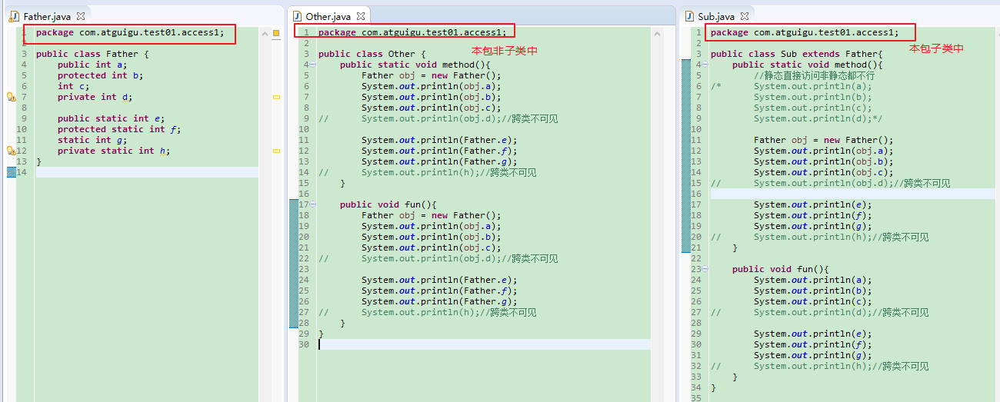
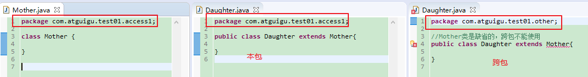
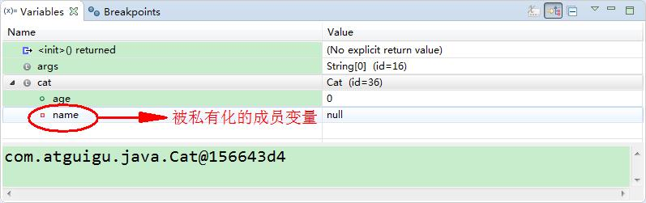
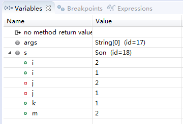
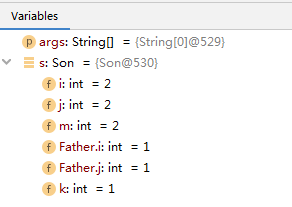
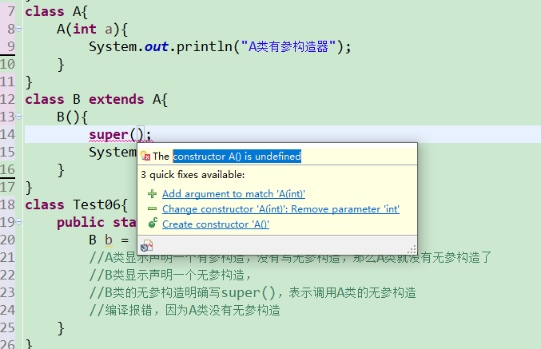
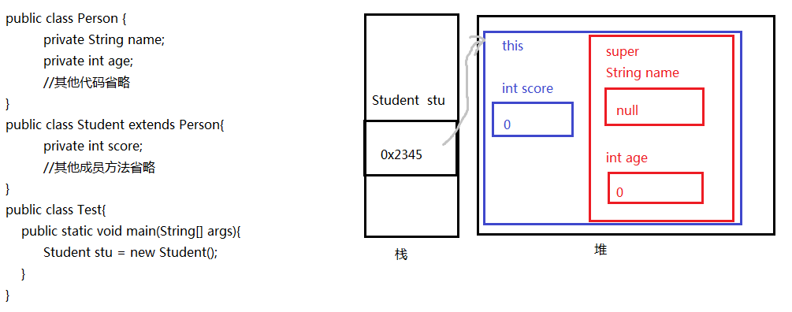
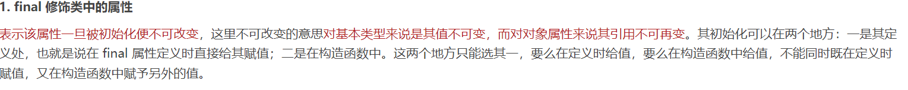

第6章【面向对象基础--中】

## 教学目标

* [ ] 理解封装的概念
* [ ] 掌握权限修饰符的使用
* [ ] 掌握成员变量的私有化
* [ ] 掌握构造器的声明与使用
* [ ] 会声明标准的JavaBean
* [ ] 能够写出类的继承格式
* [ ] 能够说出继承的特点
* [ ] 能够说出方法重写的概念以及和重载的区别
* [ ] 能够使用this关键字解决问题
* [ ] 能够使用super关键字解决问题
* [ ] 能够分析类初始化过程（为面试服务）
* [ ] 能够分析实例初始化过程（为面试服务）
* [ ] 能够应用多态解决问题
* [ ] 理解向上转型与向下转型
* [ ] 能够使用instanceof关键字判断对象类型
* [ ] 了解native关键字
* [ ] 掌握final关键字
* [ ] 了解Object类的常用方法
* [ ] 会重写Object的常用方法

# 第六章 面向对象基础--中

## 6.1 封装

面向对象三大特征：封装、继承、多态

### 6.1.1 为什么需要封装？

- 我要用洗衣机，只需要按一下开关和洗涤模式就可以了。有必要了解洗衣机内部的结构吗？有必要碰电动机吗？

- 我们使用的电脑，内部有CPU、硬盘、键盘、鼠标等等，每一个部件通过某种连接方式一起工作，但是各个部件之间又是独立的

- 现实生活中，每一个个体与个体之间是有边界的，每一个团体与团体之间是有边界的，而同一个个体、团体内部的信息是互通的，只是对外有所隐瞒。

面向对象编程语言是对客观世界的模拟，客观世界里每一个事物的内部信息都是隐藏在对象内部的，外界无法直接操作和修改，只能通过指定的方式进行访问和修改。封装可以被认为是一个保护屏障，防止该类的代码和数据被其他类随意访问。适当的封装可以让代码更容易理解与维护，也加强了代码的安全性。

随着我们系统越来越复杂，类会越来越多，那么类之间的访问边界必须把握好，面向对象的开发原则要遵循“高内聚、低耦合”，而“高内聚，低耦合”的体现之一：

- 高内聚：类的内部数据操作细节自己完成，不允许外部干涉；

- 低耦合：仅对外暴露少量的方法用于使用

隐藏对象内部的复杂性，只对外公开简单的接口。便于外界调用，从而提高系统的可扩展性、可维护性。通俗的讲，把该隐藏的隐藏起来，该暴露的暴露出来。这就是封装性的设计思想。

**通俗的讲，封装就是把该隐藏的隐藏起来，该暴露的暴露出来。**那么暴露的程度如何控制呢？就是依赖**访问控制修饰符**，也称为**权限修饰符**来控制。

	便于使用者正确使用系统，防止错误修改属性
	有助于系统之间的松耦合，提高系统独立性
	提高软件的可重用性
	降低了构建大型系统的风险
### **6.1.2 权限修饰符**

权限修饰符共有4种，分别为public，protected、缺省、private；权限修饰符可以使得数据在一定范围内可见或者隐藏。

| 修饰符           | 本类 | 本包 | 其他包子类 | 任意位置 |
| ---------------- | ---- | ---- | ---------- | -------- |
| **private**      | √    | ×    | ×          | ×        |
| **defaulta缺省** | √    | √    | ×          | ×        |
| **protected**    | √    | √    | √          | ×        |
| **public**       | √    | √    | √          | √        |

权限修饰符可以修饰：

外部类：public和缺省

成员变量、成员方法、构造器、成员内部类：public,protected,缺省,private

1. **示例一：本包非子类与子类**

   ```java
   package com.atguigu.test01.access1;
   
   public class Father {
   	public int a;
   	protected int b;
   	int c;
   	private int d;
   	
   	public static int e;
   	protected static int f;
   	static int g;
   	private static int h;
   }
   
   class Mother{
   	public Mother(){
   		
   	}
   }
   ```

   ```java
   package com.atguigu.test01.access1;
   
   //本包非子类中
   public class Other {
   	public static void method(){
   		Father obj = new Father();
   		System.out.println(obj.a);
   		System.out.println(obj.b);
   		System.out.println(obj.c);
   //		System.out.println(obj.d);//跨类不可见
   		
   		System.out.println(Father.e);
   		System.out.println(Father.f);
   		System.out.println(Father.g);
   //		System.out.println(h);//跨类不可见
   	}
   	
   	public void fun(){
   		Father obj = new Father();
   		System.out.println(obj.a);
   		System.out.println(obj.b);
   		System.out.println(obj.c);
   //		System.out.println(obj.d);//跨类不可见
   		
   		System.out.println(Father.e);
   		System.out.println(Father.f);
   		System.out.println(Father.g);
   //		System.out.println(h);//跨类不可见
   	}
   }
   
   ```

   ```java
   package com.atguigu.test01.access1;
   
   //本包子类中
   public class Sub extends Father{
   	public static void method(){
   		//静态直接访问非静态都不行
   /*		System.out.println(a);
   		System.out.println(b);
   		System.out.println(c);
   		System.out.println(d);*/
   		
   		Father obj = new Father();
   		System.out.println(obj.a);
   		System.out.println(obj.b);
   		System.out.println(obj.c);
   //		System.out.println(obj.d);//跨类不可见
   		
   		System.out.println(e);
   		System.out.println(f);
   		System.out.println(g);
   //		System.out.println(h);//跨类不可见
   	}
   	
   	public void fun(){
   		System.out.println(a);
   		System.out.println(b);
   		System.out.println(c);
   //		System.out.println(d);//跨类不可见
   		
   		System.out.println(e);
   		System.out.println(f);
   		System.out.println(g);
   //		System.out.println(h);//跨类不可见
   	}
   }
   ```

   

2. **示例二：跨包子类和非子类**

   ```java
   package com.atguigu.test01.access1;
   
   public class Father {
   	public int a;
   	protected int b;
   	int c;
   	private int d;
   	
   	public static int e;
   	protected static int f;
   	static int g;
   	private static int h;
   }
   
   ```

   ```java
   package com.atguigu.test01.other;
   
   import com.atguigu.test01.access1.Father;
   
   public class Another {
   	public static void method(){
   		Father obj = new Father();
   		System.out.println(obj.a);
   //		System.out.println(obj.b);//跨包非子类不可见
   //		System.out.println(obj.c);//跨包不可见
   //		System.out.println(obj.d);//跨类不可见
   		
   		System.out.println(Father.e);
   //		System.out.println(Father.f);//跨包非子类不可见
   //		System.out.println(Father.g);//跨包不可见
   //		System.out.println(h);//跨类不可见
   	}
   	
   	public void fun(){
   		Father obj = new Father();
   		System.out.println(obj.a);
   //		System.out.println(obj.b);//跨包非子类不可见
   //		System.out.println(obj.c);//跨包不可见
   //		System.out.println(obj.d);//跨类不可见
   		
   		System.out.println(Father.e);
   //		System.out.println(Father.f);//跨包非子类不可见
   //		System.out.println(Father.g);//跨包不可见
   //		System.out.println(h);//跨类不可见
   	}
   }
   
   ```

   ```java
   package com.atguigu.test01.other;
   
   import com.atguigu.test01.access1.Father;
   
   public class Son extends Father{
   	public static void method(){
   		//静态直接访问非静态都不行
   /*		System.out.println(a);
   		System.out.println(b);
   		System.out.println(c);
   		System.out.println(d);*/
   		
   		Father obj = new Father();
   		System.out.println(obj.a);
   //		System.out.println(obj.b);//跨包的静态成员
   						//不能访问非静态的protected
   //		System.out.println(obj.c);//跨包不可见
   //		System.out.println(obj.d);//跨类不可见
   		
   		System.out.println(e);
   		System.out.println(f);
   //		System.out.println(g);//跨包不可见
   //		System.out.println(h);//跨类不可见
   	}
   	
   	public void fun(){
   		System.out.println(a);
   		System.out.println(b);
   //		System.out.println(c);//跨包不可见
   //		System.out.println(d);//跨类不可见
   		
   		System.out.println(e);
   		System.out.println(f);
   //		System.out.println(g);//跨包不可见
   //		System.out.println(h);//跨类不可见
   	}
   }
   ```

   

3. **示例三：缺省的类**

   ```java
   package com.atguigu.test01.access1;
   
   class Mother {
   	
   }
   ```

   ```java
   package com.atguigu.test01.access1;
   
   public class Daughter extends Mother{
   
   }
   ```

   ```java
   package com.atguigu.test01.other;
   
   //Mother类是缺省的，跨包不能使用
   public class Daughter extends Mother{
   
   }
   ```

   

4. **示例四：公共的类缺省的构造器，跨包使用问题**

   ```java
   package com.atguigu.test01.access1;
   
   public class Fu {
   	Fu(){
   		
   	}
   }
   ```

   ```java
   package com.atguigu.test01.access1;
   
   public class Zi extends Fu{
   
   }
   ```

   ```java
   package com.atguigu.test01.other;
   
   import com.atguigu.test01.access1.Fu;
   
   public class Zi extends Fu{
   	Zi() {
   		super();
   	}
   }
   ```

   ```java
   package com.atguigu.test01.access1;
   
   public class Neighbor {
   	public static void main(String[] args) {
   		Fu f = new Fu();
   	}
   }
   ```

   ```java
   package com.atguigu.test01.other;
   
   import com.atguigu.test01.access1.Fu;
   
   public class AnotherNeighbor {
   	public static void main(String[] args) {
   		Fu f = new Fu();
   	}
   }
   ```

   

   

### 6.1.3 封装的实现

**成员变量（field）私有化之后，提供标准的get/set方法，我们把这种成员变量也称为属性（property）。**或者可以说只要能通过get/set操作的就是事物的属性，哪怕它没有对应的成员变量。

1. #### 成员变量封装的目的

   - 隐藏类的实现细节

   - 让使用者只能通过事先预定的方法来访问数据，从而可以在该方法里面加入控制逻辑，限制对成员变量的不合理访问。还可以进行数据检查，从而有利于保证对象信息的完整性。

   - 便于修改，提高代码的可维护性。主要说的是隐藏的部分，在内部修改了，如果其对外可以的访问方式不变的话，外部根本感觉不到它的修改。例如：Java8->Java9，String从char[]转为byte[]内部实现，而对外的方法不变，我们使用者根本感觉不到它内部的修改。

2. #### 实现步骤

   - **使用 `private` 修饰成员变量**

   ```java
   private 数据类型 变量名 ；
   ```

   代码如下：

   ```java
   public class Chinese {
       private static String country;
       private String name;
     	private int age;
       private boolean marry;
   }
   ```

   - **提供 `getXxx`方法 / `setXxx` 方法，可以访问成员变量**，代码如下：

   ```java
   public class Chinese {
     	private static String country;
       private String name;
     	private int age;
       private boolean marry;
       
       public static void setCountry(String c){
           country = c;
       }
       
       public static String getCountry(){
           return country;
       }
   
   	public void setName(String n) {
   		name = n;
       }
   
       public String getName() {
           return name;
   	}
   
       public void setAge(int a) {
           age = a;
       }
   
       public int getAge() {
           return age;
       }
       
       public void setMarry(boolean m){
           marry = m;
       }
       
       public boolean isMarry(){
           return marry;
       }
   }
   ```


### 6.1.4初识this关键字

**如何解决局部变量与成员变量同名问题？**

当局部变量与类变量（静态成员变量）同名时，在类变量前面加“类名."；

当局部变量与实例变量（非静态成员变量）同名时，在实例变量前面加“**this.**”

**this代表当前对象的引用，即当前被创建的对象**

```java
public class Chinese {
  	private static String country;
    private String name;
  	private int age;
    
    public static void setCountry(String country){
        Chinese.country = country;
    }
    
    public static String getCountry(){
        return country;
    }

	public void setName(String name) {
		this.name = name;
    }

    public String getName() {
        return name;
	}

    public void setAge(int age) {
        this.age = age;
    }

    public int getAge() {
        return age;
    }
}
```

### 6.1.5 封装练习

（1）定义矩形类Rectangle，

​	声明实例变量长和宽

​	全部私有化，并提供相应的get/set方法

（2）在测试类中创建Rectangle对象，并调用相应的方法测试

(3)定义一个Dog类 

   实例变量 名字属性 年龄属性 毛色属性  属性私有 提供get/set

在测试类中创建Dog对象，并调用相应的方法测试


## 6.2 构造器（Constructor)

我们发现我们new完对象时，所有成员变量都是默认值，如果我们需要赋别的值，需要挨个为它们再赋值，太麻烦了。我们能不能在new对象时，直接为当前对象的某个或所有成员变量直接赋值呢。

可以，Java给我们提供了构造器。

### 6.2.1 构造器的作用

用于创建并初始化对象

> **注意：构造器只为实例变量初始化，不为静态类变量初始化**

### 6.2.2 构造器的语法格式

构造器又称为构造方法或构造函数，那是因为它长的很像方法。但是和方法还有有所区别的。

```java
【修饰符】 构造器名(){
    // 实例初始化代码
}
【修饰符】 构造器名(参数列表){
	// 实例初始化代码
}
```

代码如下：

```java
public class Student {
	private String name;
	private int age;
	// 无参构造
  	public Student() {} 
 	// 有参构造
  	public Student(String name,int age) {
		this.name = name;
    	this.age = age; 
	}
  	
	public String getName() {
		return name;
	}
	public void setName(String name) {
		this.name = name;
	}
	public int getAge() {
		return age;
	}
	public void setAge(int age) {
		this.age = age;
	}
}
```

**注意事项：**

1. **构造器名必须与它所在的类名必须相同。**
2. **它没有返回值，所以不需要返回值类型，甚至不需要void**
3. 如果你不提供构造器，**系统会给出默认无参数构造器**，并且该构造器的修饰符默认与类的修饰符相同
4. **如果你提供了构造器，系统将不再提供无参数构造器**，除非你自己定义。
5. 构造器是可以重载的，既可以定义参数，也可以不定义参数。
6. 构造器的修饰符只能是权限修饰符，不能被其他任何修饰

### 6.2.3 构造器练习

（1）声明一个员工类，

* 包含属性：编号、姓名、薪资、性别，要求属性私有化，提供get/set，
* 提供无参构造器和有参构造器
* 提供getInfo()

（2）在测试类的main中分别用无参构造和有参构造创建员工类对象，调用getInfo

```java
public class TestEmployee {
	public static void main(String[] args){
		//分别用无参构造和有参构造创建对象，调用getInfo
		Employee e1 = new Employee();
		System.out.println(e1.getInfo());
		
		Employee e2 = new Employee("1001","张三",110000,'男');
		System.out.println(e2.getInfo());
		
		e2.setSalary(120000);
		System.out.println(e2.getInfo());
		
		System.out.println("e1薪资：" + e1.getSalary());
	}
}
class Employee{
	private String id;
	private String name;
	private double salary;
	private char gender;
	
	//提供无参构造器和有参构造器
	public Employee(){
		
	}
	public Employee(String id, String name){
		this.id = id;
		this.name = name;
	}
	public Employee(String id, String name, double salary, char gender){
		this.id = id;
		this.name = name;
		this.salary = salary;
		this.gender = gender;
	}
	
	public String getId() {
		return id;
	}
	public void setId(String id) {
		this.id = id;
	}
	public String getName() {
		return name;
	}
	public void setName(String name) {
		this.name = name;
	}
	public double getSalary() {
		return salary;
	}
	public void setSalary(double salary) {
		this.salary = salary;
	}
	public char getGender() {
		return gender;
	}
	public void setGender(char gender) {
		this.gender = gender;
	}
	
	//提供getInfo()
	public String getInfo(){
		return "编号：" + id + "，姓名：" + name + "，薪资：" + salary + "，性别：" +gender;
	}
}
```

### 6.2.4 this调用构造器

构造器重载时，可以在一个构造方法中调用另一构造方法，以简化代码。

格式：this（参数列表）;

```java
public Employee(){
}

public Employee(String id){
	this.id=id;
}

public Employee(String id, String name){
    this(id);//this调用一个参数的构造器
    this.name = name;
}
public Employee(String id, String name, double salary, char gender){
    this(id,name);//this调用2个参数的构造器
    this.salary = salary;
    this.gender = gender;
}
```

> **注意：**
>
> **this调用构造器的语句，只能构造器中第一行位置。**

### 6.2.5  属性赋值小结

截止到目前，我们讲了很多位置都可以对类的属性赋值。现总结这几个置，并指明赋值的先后顺序。
**赋值的位置及先后顺序：**
① 默认初始化
② 显式初始化
③ 构造器中初始化
④ 通过“对象 .属性“或对象 .方法”的式赋值

## 6.3 标准JavaBean

`JavaBean` 是 Java语言编写类的一种标准规范。符合`JavaBean` 的类，要求：

（1）类必须是具体的（非抽象）和公共的，

（2）并且具有无参数的构造方法，

（3）成员变量私有化，并提供用来操作成员变量的`set` 和`get` 方法。

（比较理解POJO : Plain Ordinary Java Object，主要承载数据，不涉及业务逻辑）

```java
public class ClassName{
  //成员变量
    
  //构造方法
  	//无参构造方法【必须】
  	//有参构造方法【建议】
  	
  //getXxx()
  //setXxx()
  //其他成员方法
}
```

 编写符合`JavaBean` 规范的类，以学生类为例，标准代码如下：

```java
public class Student {
	// 成员变量
	private String name;
	private int age;

	// 构造方法
	public Student() {
	}

	public Student(String name, int age) {
		this.name = name;
		this.age = age;
	}

	// get/set成员方法
	public void setName(String name) {
		this.name = name;
	}

	public String getName() {
		return name;
	}

	public void setAge(int age) {
		this.age = age;
	}

	public int getAge() {
		return age;
	}
    
    //其他成员方法列表
    public String getInfo(){
        return "姓名：" + name + "，年龄：" + age;
    }
}
```

测试类，代码如下：

```java
public class TestStudent {
	public static void main(String[] args) {
		// 无参构造使用
		Student s = new Student();
		s.setName("柳岩");
		s.setAge(18);
		System.out.println(s.getName() + "---" + s.getAge());
        System.out.println(s.getInfo());

		// 带参构造使用
		Student s2 = new Student("赵丽颖", 18);
		System.out.println(s2.getName() + "---" + s2.getAge());
        System.out.println(s2.getInfo());
	}
}
```

## 6.4 继承

### 6.4.1 继承的概述

财产：富二代  官二代  拆二代

样貌：如图所示：


1. #### 生活中的继承

   父辈的东西可以被孩子继承

   “子承父业”，“这孩子长得像妈妈”，“这个孩子跟爸爸一样有才华”

   

2. #### Java中的继承

   Java中有父类、子类的概念，类似生活中的父子关系，父类中的一些属性和方法可以被子类继承下来使用，不再需要重复定义。

   如图所示：

   

   多个类中存在相同属性和行为时，将这些内容抽取到单独一个类中，那么多个类中无需再定义这些属性和行为，只需要和抽取出来的类构成某种关系。如图所示：

   

   其中，多个类可以称为**子类**，也叫**派生类**；多个类抽取出来的这个类称为**父类**、**超类（superclass）**或者**基类**。

   继承描述的是事物之间的所属关系，这种关系是：`is-a` 的关系。例如，图中猫属于动物，狗也属于动物。可见，父类更通用，子类更具体。我们通过继承，可以使多种事物之间形成一种关系体系。

3. #### 继承的好处

   - 提高**代码的复用性**。
   - 提高**代码的扩展性**。
   - 类与类之间产生了关系，是学习**多态的前提**。


### 6.4.2 继承的格式

通过 `extends` 关键字，可以声明一个子类继承另外一个父类，定义格式如下：

```java
【修饰符】 class 父类 {
	...
}

【修饰符】 class 子类 extends 父类 {
	...
}

```

继承演示，代码如下：

```java
/*
 * 定义动物类Animal，做为父类
 */
class Animal {
    // 定义name属性
	String name; 
    // 定义age属性
    int age;
	// 定义动物的吃东西方法
	public void eat() {
		System.out.println(age + "岁的" + name + "在吃东西");
	}
}

/*
 * 定义猫类Cat 继承 动物类Animal
 */
class Cat extends Animal {
	// 定义一个猫抓老鼠的方法catchMouse
	public void catchMouse() {
		System.out.println("抓老鼠");
	}
}

/*
 * 定义测试类
 */
public class ExtendDemo01 {
	public static void main(String[] args) {
        // 创建一个猫类对象
		Cat cat = new Cat()；
      
        // 为该猫类对象的name属性进行赋值
		cat.name = "Tom";
      
      	// 为该猫类对象的age属性进行赋值
		cat.age = 2;
        
        // 调用该猫的catchMouse()方法
		cat.catchMouse();
		
      	// 调用该猫继承来的eat()方法
      	cat.eat();
	}
}

演示结果：
抓老鼠
2岁的Tom在吃东西
```

### 6.4.3 继承中成员变量的特点

子类可以继承父类的所有属性和方法，并直接使用（私有的例外）

1. #### 父类的私有属性（private）

   - 子类继承父类的所有的属性，但是私有的属性不能直接访问（也可以理解为私有的属性不能被继承，[官方文档中的说法](https://docs.oracle.com/javase/tutorial/java/IandI/subclasses.html)）

   - 子类不能直接进行访问父类的私有属性，但可以通过继承的getter/setter方法进行访问。如图所示：

     ​	

   示例代码如下：

   ```java
   /*
    * 定义动物类Animal，做为父类
    */
   class Animal {
       // 定义name属性
   	private String name; 
       // 定义age属性
       public int age;
   	// 定义动物的吃东西方法
   	public void eat() {
   		System.out.println(age + "岁的" + name + "在吃东西");
   	}
   }
   
   /*
    * 定义猫类Cat 继承 动物类Animal
    */
   class Cat extends Animal {
   	// 定义一个猫抓老鼠的方法catchMouse
   	public void catchMouse() {
   		System.out.println("抓老鼠");
   	}
   }
   
   /*
    * 定义测试类
    */
   public class ExtendDemo01 {
   	public static void main(String[] args) {
           // 创建一个猫类对象
   		Cat cat = new Cat()；
         
           // 为该猫类对象的name属性进行赋值
   		//cat.name = "Tom";// 编译报错
         
         	// 为该猫类对象的age属性进行赋值
   		cat.age = 2;
           
           // 调用该猫的catchMouse()方法
   		cat.catchMouse();
   		
         	// 调用该猫继承来的eat()方法
         	cat.eat();
   	}
   }
   ```

   如图所示：

   eclipse中Debug查看对象成员变量值的情况截图如下：

   

   idea中Debug查看对象成员变量值的情况截图如下：

   

   

2. #### 父子类成员变量重名（初始super关键字）

   父类的成员变量会被子类继承，并可以直接使用，也可以在子类中定义同名的成员变量，这样会隐藏掉父类的成员变量（不建议）。

   (也可以理解为就近访问-就近原则）。如果还想在子类中访问父类的成员变量，可以使用关键字**super**。

   **super用于在当前类中访问其父类的成员**，使用格式：

   ```java
   super.父类成员变量名
   ```

   示例父类代码：

   ```java
   public class Father {
   	public int i=1;
   	private int j=1;
   	public int k=1;
   	public int getJ() {
   		return j;
   	}
   	public void setJ(int j) {
   		this.j = j;
   	}
   }
   ```

   子类代码：

   ```java
   public class Son extends Father{
   	public int i=2;
   	private int j=2;
   	public int m=2;
   }	
   ```

   现在想要在子类Son中声明一个test()方法，并打印这些所有变量的值，该如何实现？

   ```java
   public class Son extends Father{
   	public int i=2;
   	private int j=2;
   	public int m=2;
   	
   	public void test() {
   		System.out.println("父类继承的i：" + super.i);
   		System.out.println("子类的i：" +i);
   //		System.out.println(super.j);
   		System.out.println("父类继承的j：" +getJ());
   		System.out.println("子类的j：" +j);
   		System.out.println("父类继承的k：" +k);
   		System.out.println("子类的m：" +m);
   	}	
   }	
   ```

   

   以上test()调用结果：

   ```java
   public class TestSon{
   	public static void main(String[] args){
   		Son s = new Son();
   		s.test();
   	}
   }
   ```

   ```java
   父类继承的i：1
   子类的i：2
   父类继承的j：1
   子类的j：2
   父类继承的k：1
   子类的m：2
   ```

   eclipse中Debug查看对象的成员变量的值截图如下：

   

   idea中Debug查看对象的成员变量的值截图如下：

   

   > 说明：虽然我们可以区分父子类的重名成员变量，但是实际开发中，我们不建议这么干。

   

### 6.4.4 方法重写（Override）

当子类继承了父类的某个方法之后，发现这个方法并不能满足子类的实际需求，那么可以通过方法重写，覆盖父类的方法。

**方法重写：子类中定义与父类中相同的方法，一般方法体不同，用于改造并覆盖父类的方法。**

**具体要求：**

1. 必须保证父子类之间方法的名称相同，参数列表也相同。
2. 子类方法的返回值类型必须与父类方法的返回值类型相同或者为父类方法返回值类型的子类类型。
3. 子类方法的访问权限必须不能小于父类方法的访问权限。（public > protected > 缺省 > private）
4. 子类方法 抛出的异常不能大于父被重写的异常（异常后面再讲）

比如新的手机增加来电显示头像的功能，代码如下：

```java
class Phone {
	public void sendMessage(){
		System.out.println("发短信");
	}
	public void call(){
		System.out.println("打电话");
	}
	public void showNum(){
		System.out.println("来电显示号码");
	}
}

//智能手机类
class NewPhone extends Phone {
	
	//重写父类的来电显示号码功能，并增加自己的显示姓名和图片功能
	public void showNum(){
		//调用父类已经存在的功能使用super
		super.showNum();
		//增加自己特有显示姓名和图片功能
		System.out.println("显示来电姓名");
		System.out.println("显示头像");
	}
}

public class ExtendsDemo06 {
	public static void main(String[] args) {
      	// 创建子类对象
      	NewPhone np = new NewPhone()；
        
        // 调用父类继承而来的方法
        np.call();
      
      	// 调用子类重写的方法
      	np.showNum();

	}
}
```

> 小贴士：这里重写时，用到super.父类成员方法，表示调用父类的成员方法。

**注意事项：**

- 静态方法不能被重写，方法重写指的是实例方法重写，静态方法属于类的方法不能被重写，而是隐藏。

- 私有等在子类中不可见的方法不能被重写

- final方法不能被重写

### 6.4.5 继承中的构造方法

当类之间产生了关系，其中各类中的构造方法，又产生了哪些影响呢？

首先我们要回忆两个事情，构造方法的定义格式和作用。

1. 构造方法的名字是与类名一致的。

   所以子类是**无法继承**父类构造方法的。

2. 构造方法的作用是初始化实例变量的，而子类又会从父类继承所有成员变量

   所以子类的初始化过程中，**必须**先执行父类的初始化动作。子类的构造方法中默认有一个`super()` ，表示调用父类的实例初始化方法，父类成员变量初始化后，才可以给子类使用。代码如下：

```java
class Fu {
  private int n;
  Fu(){
    System.out.println("Fu()");
  }
}
class Zi extends Fu {
  Zi(){
    // super（），调用父类构造方法
    super();//默认隐藏
    System.out.println("Zi（）");
  }  
}
public class ExtendsDemo07{
  public static void main (String args[]){
    Zi zi = new Zi();
  }
}
输出结果：
Fu（）
Zi（）
```

如果父类没有无参构造怎么办？

```java
public class Person {
	private String name;
	private int age;
	public Person(String name, int age) {
		this.name = name;
		this.age = age;
	}
	//其他成员方法省略
}
```

```java
public class Student extends Person{
	private int score;
}
```

此时子类代码报错。

解决办法：在子类构造器中，用super(实参列表)，显示调用父类的有参构造解决。

```java
public class Student extends Person{
	private int score;

	public Student(String name, int age) {
		super(name, age);
	}
	public Student(String name, int age, int score) {
		super(name, age);
		this.score = score;
	}
	
	//其他成员方法省略
}
```

**结论：**

子类对象实例化过程中必须先完成从父类继承的成员变量的实例初始化，这个过程是通过调用父类的构造方法来完成的。

**也就是说子类的构造方法中至少有一个构造方法显示或隐式的通过super关键字调用了父类的某一个构造方法，否则编译失败。**

* super()：表示调用父类的无参实例初始化方法，要求父类必须有无参构造，而且可以省略不写；
* super(实参列表)：表示调用父类的有参实例初始化方法，当父类没有无参构造时，子类的构造器首行必须写super(实参列表)来明确调用父类的哪个有参构造（其实是调用该构造器对应的实例初始方法）
* super()和super(实参列表)都只能出现在子类构造器的首行

形式一：

```java
class A{

}
class B extends A{

}

class Test{
    public static void main(String[] args){
        B b = new B();
        //A类和B类都是默认有一个无参构造，B类的默认无参构造中还会默认调用A类的默认无参构造
        //但是因为都是默认的，没有打印语句，看不出来
    }
}
```

形式二：

```java
class A{
	A(){
		System.out.println("A类无参构造器");
	}
}
class B extends A{

}
class Test{
    public static void main(String[] args){
        B b = new B();
        //A类显示声明一个无参构造，
		//B类默认有一个无参构造，
		//B类的默认无参构造中会默认调用A类的无参构造
        //可以看到会输出“A类无参构造器"
    }
}
```

形式三：

```java
class A{
	A(){
		System.out.println("A类无参构造器");
	}
}
class B extends A{
	B(){
		System.out.println("B类无参构造器");
	}
}
class Test{
    public static void main(String[] args){
        B b = new B();
        //A类显示声明一个无参构造，
		//B类显示声明一个无参构造，        
		//B类的无参构造中虽然没有写super()，但是仍然会默认调用A类的无参构造
        //可以看到会输出“A类无参构造器"和"B类无参构造器")
    }
}
```

形式四：

```java
class A{
	A(){
		System.out.println("A类无参构造器");
	}
}
class B extends A{
	B(){
        super();
		System.out.println("B类无参构造器");
	}
}
class Test{
    public static void main(String[] args){
        B b = new B();
        //A类显示声明一个无参构造，
		//B类显示声明一个无参构造，        
		//B类的无参构造中明确写了super()，表示调用A类的无参构造
        //可以看到会输出“A类无参构造器"和"B类无参构造器")
    }
}
```

形式五：

```java
class A{
	A(int a){
		System.out.println("A类有参构造器");
	}
}
class B extends A{
	B(){
		System.out.println("B类无参构造器");
	}
}
class Test05{
    public static void main(String[] args){
        B b = new B();
        //A类显示声明一个有参构造，没有写无参构造，那么A类就没有无参构造了
		//B类显示声明一个无参构造，        
		//B类的无参构造没有写super(...)，表示默认调用A类的无参构造
        //编译报错，因为A类没有无参构造
    }
}
```


形式六：

```java
class A{
	A(int a){
		System.out.println("A类有参构造器");
	}
}
class B extends A{
	B(){
		super();
		System.out.println("B类无参构造器");
	}
}
class Test06{
    public static void main(String[] args){
        B b = new B();
        //A类显示声明一个有参构造，没有写无参构造，那么A类就没有无参构造了
		//B类显示声明一个无参构造，        
		//B类的无参构造明确写super()，表示调用A类的无参构造
        //编译报错，因为A类没有无参构造
    }
}
```



形式七：

```java
class A{
	A(int a){
		System.out.println("A类有参构造器");
	}
}
class B extends A{
	B(int a){
		super(a);
		System.out.println("B类有参构造器");
	}
}
class Test07{
    public static void main(String[] args){
        B b = new B(10);
        //A类显示声明一个有参构造，没有写无参构造，那么A类就没有无参构造了
		//B类显示声明一个有参构造，        
		//B类的有参构造明确写super(a)，表示调用A类的有参构造
        //会打印“A类有参构造器"和"B类有参构造器"
    }
}
```

形式八：

```java
class A{
    A(){
        System.out.println("A类无参构造器");
    }
	A(int a){
		System.out.println("A类有参构造器");
	}
}
class B extends A{
    B（）{
        super();//可以省略，调用父类的无参构造
        System.out.println("B类无参构造器");
    }
	B(int a){
		super(a);//调用父类有参构造
		System.out.println("B类有参构造器");
	}
}
class Test8{
    public static void main(String[] args){
        B b1 = new B();
        B b2 = new B(10);
    }
}
```


### 6.4.6 继承的单继承限制

1. Java只支持单继承，不支持多继承。

   ```java
   //一个类只能有一个父类，不可以有多个父类。
   class C extends A{} 	//ok
   class C extends A，B...	//error
   ```

2. Java支持多层继承(继承体系)。

   ```java
   class A{}
   class B extends A{}
   class C extends B{}
   ```

   > 顶层父类是Object类。所有的类默认继承Object，作为父类。

3. 子类和父类是一种相对的概念。

   例如：B类对于A来说是子类，但是对于C类来说是父类

4. 一个父类可以同时拥有多个子类

### 6.4.7 继承练习

**练习1**

（1）父类Graphic图形
包含属性：name（图形名），属性私有化，不提供无参构造，只提供有参构造
包含求面积getArea()：返回0.0
求周长getPerimeter()方法：返回0.0
显示信息getInfo()方法：返回图形名称、面积、周长

（2）子类Circle圆继承Graphic图形
包含属性：radius
重写求面积getArea()和求周长getPerimeter()方法，显示信息getInfo()加半径信息

（3）子类矩形Rectange继承Graphic图形
包含属性：length、width
重写求面积getArea()和求周长getPerimeter()方法

```java
public class Graphic {
	private String name;

	public Graphic(String name) {
		super();
		this.name = name;
	}

	public String getName() {
		return name;
	}

	public void setName(String name) {
		this.name = name;
	}

	public double getArea() {
		return 0.0;
	}

	public double getPerimeter() {
		return 0.0;
	}

	/*
	 * this对象：调用当前方法的对象，如果是Graphic对象，那么就会执行Graphic的getArea()和getPerimeter()
	 * this对象：调用当前方法的对象，如果是Circle对象，那么就会执行Circle的getArea()和getPerimeter()
	 * this对象：调用当前方法的对象，如果是Rectangle对象，那么就会执行Rectangle的getArea()和getPerimeter()
	 */
	public String getInfo() {
		return "图形：" + name + "，面积：" + getArea() + ",周长：" + getPerimeter();
	}
}
```

```java
public class Circle extends Graphic {
	private double radius;

	public Circle(String name, double radius) {
		super(name);
		this.radius = radius;
	}

	public double getRadius() {
		return radius;
	}

	public void setRadius(double radius) {
		this.radius = radius;
	}

	@Override//表示这个方法是重写的方法
	public double getArea() {
		return Math.PI * radius * radius;
	}

	@Override//表示这个方法是重写的方法
	public double getPerimeter() {
		return Math.PI * radius * 2;
	}

	/*@Override//表示这个方法是重写的方法
	public String getInfo() {
		return super.getInfo() + "，半径：" + radius;
	}*/
	
}

```

```java
public class Rectangle extends Graphic {
	private double length;
	private double width;
	
	public Rectangle(String name, double length, double width) {
		super(name);
		this.length = length;
		this.width = width;
	}

	public double getLength() {
		return length;
	}

	public void setLength(double length) {
		this.length = length;
	}

	public double getWidth() {
		return width;
	}

	public void setWidth(double width) {
		this.width = width;
	}

	@Override
	public double getArea() {
		return length*width;
	}

	@Override
	public double getPerimeter() {
		return 2*(length + width);
	}
}

```

```java
public class TestGraphicExer3 {
	public static void main(String[] args) {
		Graphic g = new Graphic("通用图形");
		System.out.println(g.getInfo());
		
		Circle c = new Circle("圆", 1.2);
		System.out.println(c.getInfo());//调用getInfo()方法的对象是c
		
		Rectangle r = new Rectangle("矩形", 3, 5);
		System.out.println(r.getInfo());
	}
}
```


**练习2**

1、声明父类：Person类
包含属性：姓名，年龄，性别
属性私有化，get/set
包含getInfo()方法：例如：姓名：张三，年龄：23，性别：男

2、声明子类：Student类，继承Person类
新增属性：score成绩
属性私有化，get/set
包含getInfo()方法：例如：姓名：张三，年龄：23，性别：男，成绩：89

3、声明子类：Teacher类，继承Person类
新增属性：salary薪资
属性私有化，get/set
包含getInfo()方法：例如：姓名：张三，年龄：23，性别：男，薪资：10000

```java
public class Person {
	private String name;
	private int age;
	private char gender;
	public Person(String name, int age, char gender) {
		super();
		this.name = name;
		this.age = age;
		this.gender = gender;
	}
	public Person() {
		super();
	}
	public String getName() {
		return name;
	}
	public void setName(String name) {
		this.name = name;
	}
	public int getAge() {
		return age;
	}
	public void setAge(int age) {
		this.age = age;
	}
	public char getGender() {
		return gender;
	}
	public void setGender(char gender) {
		this.gender = gender;
	}
	
	//包含getInfo()方法：例如：姓名：张三，年龄：23，性别：男
	public String getInfo(){
		return "姓名：" + name + "，年龄：" + age +"，性别：" + gender;
	}
}
```

```java
public class Student extends Person {
	private int score;

	public Student() {
	}

	public Student(String name, int age, char gender, int score) {
		setName(name);
		setAge(age);
		setGender(gender);
		this.score = score;
	}

	public int getScore() {
		return score;
	}

	public void setScore(int score) {
		this.score = score;
	}
	//包含getInfo()方法：例如：姓名：张三，年龄：23，性别：男，成绩：89
	public String getInfo(){
		//方式一：
//		return "姓名：" + getName() + "，年龄：" + getAge() + "，成绩：" + score;
		
		//方法二：
		return super.getInfo() + "，成绩：" + score;
	}
	
}
```

```java
public class Teacher extends Person {
	private double salary;

	public Teacher() {
	}

	public Teacher(String name, int age, char gender, double salary) {
		setName(name);
		setAge(age);
		setGender(gender);
		this.salary = salary;
	}

	public double getSalary() {
		return salary;
	}

	public void setSalary(double salary) {
		this.salary = salary;
	}
	
	//包含getInfo()方法：例如：姓名：张三，年龄：23，性别：男，薪资：10000
	public String getInfo(){
		return super.getInfo() + "，薪资：" + salary;
	}
}

```

```java
public class TestPersonExer2 {
	public static void main(String[] args) {
		Person p = new Person("张三", 23, '男');
		System.out.println(p.getInfo());
		
		Student s = new Student("李四", 25, '男', 89);
		System.out.println(s.getInfo());
		
		Teacher t = new Teacher("王五", 18, '男', 11111);
		System.out.println(t.getInfo());
	}
}
```

## 6.5 this和super关键字

```
1.构造器不能继承

2.如果一个类中没有显示声明构造器那么此类就会有一个隐藏的无参的默认的构造器
  该构造器的首行会有一个 super() 调用父类的无参构造

3.任何构造器的首行都会有一个super() 调用父类无参的构造器

4.可以手动设置调用父类有参的构造器
```

### 6.5.1 this关键字

1. #### this的含义

   - this代表当前对象的引用

2. #### this使用位置

   - this在实例初始化相关的代码块和构造器中：表示正在创建的那个实例对象，即正在new谁，this就代表谁

   - this在非静态实例方法中：表示调用该方法的对象，即谁在调用，this就代表谁。

   - this不能出现在静态代码块和静态方法中

3. #### this使用格式

   - **（1）this.成员变量名**

     - 当方法的局部变量与当前对象的成员变量重名时，就可以在成员变量前面加this.，如果没有重名问题，就可以省略this.

     - this.成员变量会先从本类声明的成员变量列表中查找，如果未找到，会去从父类继承的在子类中仍然可见的成员变量列表中查找

   - **（2）this.成员方法**

     - 调用当前对象的成员方法时，都可以加"this."，也可以省略，实际开发中都省略
     - 当前对象的成员方法，先从本类声明的成员方法列表中查找，如果未找到，会去从父类继承的在子类中仍然可见的成员方法列表中查找

   - **（3）this()或this(实参列表)**

     - 只能调用本类的其他构造器

     - 必须在构造器的首行

     - 如果一个类中声明了n个构造器，则最多有 n - 1个构造器中使用了"this(【实参列表】)"，否则会发生递归调用死循环

       

### 6.5.2  super关键字

1. #### 1、super的含义

   - super是用于在当前类中访问父类的一个特殊关键字，不是对象的引用。（区别this ：super不能单独使用赋值给一个变量）

2. #### 2、super使用的前提

   - 通过super引用父类的xx，都是在子类中仍然可见的

   - 不能在静态代码块和静态方法中使用super

3. #### 3、super的使用格式

   - **（1）super.成员变量**

     在子类中访问父类的成员变量，特别是当子类的成员变量与父类的成员变量重名时。

     ```java
     public class Person {
     	private String name;
     	private int age;
     	//其他代码省略
     }
     public class Student extends Person{
     	private int score;
     	//其他成员方法省略
     }
     public class Test{
         public static void main(String[] args){
         	Student stu = new Student();
         }
     }
     ```

     

     ```java
     public class Test{
         public static void main(String[] args){
         	Son s = new Son();
         	s.test(30);
         }
     }
     class Father{
     	int a = 10;
     }
     class Son extends Father{
     	int a = 20;
     	public void test(int a){
     		System.out.println(super.a);//10
     		System.out.println(this.a);//20
     		System.out.println(a);//30
     	}
     }
     ```

   - **（2）super.成员方法**

     在子类中调用父类的成员方法，特别是当子类重写了父类的成员方法时

     ```java
     public class Test{
         public static void main(String[] args){
         	Son s = new Son();
         	s.test();
         }
     }
     class Father{
     	public void method(){
     		System.out.println("aa");
     	}
     }
     class Son extends Father{
     	public void method(){
     		System.out.println("bb");
     	}
     	public void test(){
     		method();//bb
     		this.method();//bb
     		super.method();//aa
     	}
     }
     ```

   - **（3）super()或super(实参列表)**

     在子类的构造器首行，用于表示调用父类的哪个实例初始化方法

     > super() 和 this() 都必须是在构造方法的第一行，所以不能同时出现。

### 6.5.3  就近原则和追根溯源原则

在继承关系中，如果要访问变量或方法，通常遵循就近原则和追根溯源原则，即先在调用位置最近的位置查找变量或方法，如果没有则去父类找查找，找不到则报错。

1、找变量

* **没有super和this**
  * 在构造器、代码块、方法中如果出现使用某个变量，先查看是否是当前块声明的局部变量，
  * 如果不是局部变量，先从当前执行代码的本类去找成员变量
  * 如果从当前执行代码的本类中没有找到，会往上找父类的（非private，跨包还不能是缺省的）

* **this** ：代表当前对象
  * 通过this找成员变量时，先从当前执行代码的本类中找，没有的会往上找父类的（非private，跨包还不能是缺省的）。

* **super** ：代表父类的
  * 通过super找成员变量，直接从当前执行代码所在类的父类找
  * super()或super(实参列表)只能从直接父类找
  * 通过super只能访问父类在子类中可见的（非private，跨包还不能是缺省的）


> 注意：super和this都不能出现在静态方法和静态代码块中，因为super和this都是存在与**对象**中的

2、找方法

* 没有super和this
  * 先从当前对象（调用方法的对象）的本类找，如果没有，再从直接父类找，再没有，继续往上追溯

* this
  * 先从当前对象（调用方法的对象）的本类找，如果没有，再从父类继承的可见的方法列表中查找

* super
  * 直接从当前对象（调用方法的对象）的父类继承的可见的方法列表中查找


### 6.5.4 练习

1. ##### （1）情形1:父类，子类及子类方法中存在同名变量时

   ```java
   class Father{
   	int a = 10;
   	int b = 11;
   }
   class Son extends Father{
   	int a = 20;
   	
   	public void test(){
   		//子类与父类的属性同名，子类对象中就有两个a
   		System.out.println("父类的a：" + super.a);//10    直接从父类局部变量找
   		System.out.println("子类的a：" + this.a);//20   先从本类成员变量找
   		System.out.println("子类的a：" + a);//20  先找局部变量找，没有再从本类成员变量找
   		
   		//子类与父类的属性不同名，是同一个b
   		System.out.println("b = " + b);//11  先找局部变量找，没有再从本类成员变量找，没有再从父类找
   		System.out.println("b = " + this.b);//11   先从本类成员变量找，没有再从父类找
   		System.out.println("b = " + super.b);//11  直接从父类局部变量找
   	}
   	
   	public void method(int a){
   		//子类与父类的属性同名，子类对象中就有两个成员变量a，此时方法中还有一个局部变量a
   		System.out.println("父类的a：" + super.a);//10  直接从父类局部变量找
   		System.out.println("子类的a：" + this.a);//20  先从本类成员变量找
   		System.out.println("局部变量的a：" + a);//30  先找局部变量
   	}
       
       public void fun(int b){
           System.out.println("b = " + b);//13  先找局部变量
   		System.out.println("b = " + this.b);//11  先从本类成员变量找
   		System.out.println("b = " + super.b);//11  直接从父类局部变量找
       }
   }
   public class TestInherite2 {
   	public static void main(String[] args) {
   		Son son = new Son();
   		System.out.println(son.a);//20
   		System.out.println(son.b);//11
   		
   		son.test();
   		
   		son.method(30);
           
           son.fun(13);
   	}
   }
   ```

2. ##### （2）情形2：父子类中找方法

   ```java
   public class Test{
       public static void main(String[] args){
       	Son s = new Son();
       	System.out.println(s.getNum());//10   没重写，先找本类，没有，找父类
       	
       	Daughter d = new Daughter();
       	System.out.println(d.getNum());//20  重写了，先找本类
       }
   }
   class Father{
   	protected int num = 10;
   	public int getNum(){
   		return num;
   	}
   }
   class Son extends Father{
   	private int num = 20;
   }
   class Daughter extends Father{
   	private int num = 20;
   	public int getNum(){
   		return num;
   	}
   }
   ```

3. ##### （3）情形3：

   ```java
   public class Test{
       public static void main(String[] args){
       	Son s = new Son();
       	s.test();
       	
       	Daughter d = new Daughter();
       	d.test();
       }
   }
   class Father{
   	protected int num = 10;
   	public int getNum(){
   		return num;
   	}
   }
   class Son extends Father{
   	private int num = 20;
   	public void test(){
   		System.out.println(getNum());//10  本类没有找父类
   		System.out.println(this.getNum());//10  本类没有找父类
   		System.out.println(super.getNum());//10  本类没有找父类
   	}
   }
   class Daughter extends Father{
   	private int num = 20;
   	public int getNum(){
   		return num;
   	}
   	public void test(){
   		System.out.println(getNum());//20  先找本类
   		System.out.println(this.getNum());//20  先找本类
   		System.out.println(super.getNum());//10  直接找父类
   	}
   }
   ```

## 6.6 成员变量初始化赋值

### 6.6.1 成员变量初始化方式

1. #### 成员变量有默认值

   | 类别     | 具体类型                       | 默认值   |
   | -------- | ------------------------------ | -------- |
   | 基本类型 | 整数（byte，short，int，long） | 0        |
   |          | 浮点数（float，double）        | 0.0      |
   |          | 字符（char）                   | '\u0000' |
   |          | 布尔（boolean）                | false    |
   |          | 数据类型                       | 默认值   |
   | 引用类型 | 数组，类，接口                 | null     |

   我们知道类中成员变量都有默认值，但是现在我们要为成员变量赋默认值以外的值，我们该怎么办呢？

2. #### 显式赋值

   ```java
   public class Student{
       public static final String COUNTRY = "中华人民共和国";
   	private static String school = "尚硅谷";
   	private String name;
   	private char gender = '男';
   }
   ```

   > 显式赋值，一般都是赋常量值

3. #### 代码块

   如果成员变量想要初始化的值不是一个硬编码的常量值，而是需要通过复杂的计算或读取文件、或读取运行环境信息等方式才能获取的一些值，该怎么办呢？

   * **静态初始化块：为静态变量初始化**


```java

  【修饰符】 class 类名{
      static{
          静态初始化块
      }
  }
 


  * **实例初始化块：为实例变量初始化**
```


```java

     【修饰符】 class 类名{
         {
             实例初始化块
         }
     }   
    
   

    **静态初始化块：在类初始化时由类加载器调用执行，每一个类的静态初始化只会执行一次。**

    **实例初始化块：每次new实例对象时自动执行，每new一个对象，执行一次。**
```


```java

       public class Student{
       	private static String school;
       	private String name;
       	private char gender;
       	
       	static{
       		//获取系统属性，这里只是说明school的初始化过程可能比较复杂
       		school = System.getProperty("school");
       		if(school==null) {
       			school = "尚硅谷";
       		}
       	}
       	{
       		String info = System.getProperty("gender");
       		if(info==null) {
       			gender = '男';
       		}else {
       			gender = info.charAt(0);
       		}
       	}
       	public static String getSchool() {
       		return school;
       	}
       	public static void setSchool(String school) {
       		Student.school = school;
       	}
       	public String getName() {
       		return name;
       	}
       	public void setName(String name) {
       		this.name = name;
       	}
       	public char getGender() {
       		return gender;
       	}
       	public void setGender(char gender) {
       		this.gender = gender;
       	}
       
       }
```


​         


4. #### 构造器

   我们发现，显式赋值和实例初始化块为每一个实例对象的实例变量初始化的都是相同的值，那么我们如果想要不同的实例对象初始化为不同的值，怎么办呢？此时我们可以考虑使用构造器，在new对象时由对象的创建者决定为当前对象的实例变量赋什么值。

   > **注意：通常构造器只为实例变量初始化，不为静态类变量初始化**

   为实例变量初始化，再new对象时由对象的创建者决定为当前对象的实例变量赋什么值。

   

### 6.6.2 类变量初始化

类使用前，需要先把类加载到内存进行数据初始化。(类的加载过程：加载->连接->初始化->)

- 类加载过程会对类（静态）变量进行初始化并赋值（默认值->直接显示赋值）。
- 类加载过程中静态代码块也会执行，可以为类变量赋值。
- 类加载并初始化只会进行一次，如果子类初始化时，发现父类没有初始化，那么会先初始化父类。

类的初始化的目的：

   给类中的静态成员变量赋值

   1.显示赋值

   2.静态代码块赋值

   在进行类初始化时，会将上述两部分内容合并到<clinit>（系统方法 java作者提供）

注意：

   1.类的初始化会执行<clinit>

   2.显示赋值语句 静态代码块赋值 谁先写 先执行谁

   3.类的初始化只会执行一次

   4.那些操作会导致类的初始化

​       在类中写main()

​       使用了本类中的资源

 如果存在继承关系 那么先进行父类初始化 再进行子类初始化 父子类初始化使用了同一个<clinit>


类的初始化滞后：子类调用了父类的静态资源，只会导致父类的初始化，不会导致子类初始化

**示例代码1：单个类**

```java
public class Test{
    public static void main(String[] args){
    	Father.test();
    }
}
class Father{
	private static int a = getNumber();//这里调用方法为a变量显式赋值的目的是为了看到这个过程
	static{
		System.out.println("Father(1)");
	}
	private static int b = getNumber();
	static{
		System.out.println("Father(2)");
	}
	
	public static int getNumber(){
		System.out.println("getNumber()");
		return 1;
	}
	
	public static void test(){
		System.out.println("Father:test()");
	}
}
```

```java
运行结果：
getNumber()
Father(1)
getNumber()
Father(2)
Father:test()
```

**示例代码2：父子类**

```java
public class Test{
    public static void main(String[] args){
    	Son.test();
        System.out.println("-----------------------------");
        Son.test();
    }
}
class Father{
	private static int a = getNumber();
	static{
		System.out.println("Father(1)");
	}
	private static int b = getNumber();
	static{
		System.out.println("Father(2)");
	}
	
	public static int getNumber(){
		System.out.println("Father:getNumber()");
		return 1;
	}
}
class Son extends Father{
	private static int a = getNumber();
	static{
		System.out.println("Son(1)");
	}
	private static int b = getNumber();
	static{
		System.out.println("Son(2)");
	}
	
	public static int getNumber(){
		System.out.println("Son:getNumber()");
		return 1;
	}
	
	public static void test(){
		System.out.println("Son:test()");
	}	
}
```

```java
运行结果：
Father:getNumber()
Father(1)
Father:getNumber()
Father(2)
Son:getNumber()
Son(1)
Son:getNumber()
Son(2)
Son:test()
-----------------------------
Son:test()
```

### 6.6.3 实例变量初始化

实例变量的初始化值是在实例初始化过程中完成的，即创建对象时。

整个实例初始化过程中，还可以通过以下方式给实例变量赋值：

1. 默认初始值
2. 显示直接赋值
3. 构造代码块
4. 构造器

其中2和3 是按照先后代码的书写顺序进行赋值的。

```
注意：
1.实例初始化，会将上述类容合并到<init>
2.每创建一次对象就会执行一次实例初始化
3.如果有父子继承关系，首先进行父类的实例化，再进行子类的实例化
4.4.如果有父子类继承关系  父类有单独的<inti> 子类也有单独的<init>
```

```
动态方法如果有重写，则父类初始化时，要重写方法要调用子类的
静态方法则调用父类，因为静态方法没有重写
```


1. #### 示例代码1：单个类

   ```java
   public class Test{
       public static void main(String[] args){
       	Father f1 = new Father();
       	Father f2 = new Father("atguigu");
       }
   }
   class Father{
   	private int a = getNumber();
   	private String info;
   	{
   		System.out.println("Father(1)");
   	}
   	Father(){
   		System.out.println("Father()无参构造");
   	}
   	Father(String info){
   		this.info = info;
   		System.out.println("Father(info)有参构造");
   	}
   	private int b = getNumber();
   	{
   		System.out.println("Father(2)");
   	}
   	
   	public int getNumber(){
   		System.out.println("Father:getNumber()");
   		return 1;
   	}
   }
   ```

   ```java
   运行结果：
   Father:getNumber()
   Father(1)
   Father:getNumber()
   Father(2)
   Father()无参构造
   Father:getNumber()
   Father(1)
   Father:getNumber()
   Father(2)
   Father(info)有参构造
   ```

   

2. #### 示例代码2：父子类

   ```java
   public class Test{
       public static void main(String[] args){
       	Son s1 = new Son();
           System.out.println("-----------------------------");
       	Son s2 = new Son("atguigu");
       }
   }
   class Father{
   	private int a = getNumber();
   	private String info;
   	{
   		System.out.println("Father(1)");
   	}
   	Father(){
   		System.out.println("Father()无参构造");
   	}
   	Father(String info){
   		this.info = info;
   		System.out.println("Father(info)有参构造");
   	}
   	private int b = getNumber();
   	{
   		System.out.println("Father(2)");
   	}
   	
   	public static int getNumber(){
   		System.out.println("Father:getNumber()");
   		return 1;
   	}
   }
   class Son extends Father{
   	private int a = getNumber();
   	{
   		System.out.println("Son(1)");
   	}
   	private int b = getNumber();
   	{
   		System.out.println("Son(2)");
   	}
   	public Son(){
   		System.out.println("Son()：无参构造");
   	}
   	public Son(String info){
   		super(info);
   		System.out.println("Son(info)：有参构造");
   	}
   	public static int getNumber(){
   		System.out.println("Son:getNumber()");
   		return 1;
   	}
   }
   ```

   ```java
   运行结果：
   Father:getNumber()
   Father(1)
   Father:getNumber()
   Father(2)
   Father()无参构造
   Son:getNumber()
   Son(1)
   Son:getNumber()
   Son(2)
   Son()：无参构造
   -----------------------------
   Father:getNumber()
   Father(1)
   Father:getNumber()
   Father(2)
   Father(info)有参构造
   Son:getNumber()
   Son(1)
   Son:getNumber()
   Son(2)
   Son(info)：有参构造
   ```

3. #### 示例代码3：父子类，方法有重写

   ```java
   public class Test{
       public static void main(String[] args){
       	Son s1 = new Son();
       	System.out.println("-----------------------------");
       	Son s2 = new Son("atguigu");
       }
   }
   class Father{
   	private int a = getNumber();
   	private String info;
   	{
   		System.out.println("Father(1)");
   	}
   	Father(){
   		System.out.println("Father()无参构造");
   	}
   	Father(String info){
   		this.info = info;
   		System.out.println("Father(info)有参构造");
   	}
   	private int b = getNumber();
   	{
   		System.out.println("Father(2)");
   	}
   	
   	public int getNumber(){
   		System.out.println("Father:getNumber()");
   		return 1;
   	}
   }
   class Son extends Father{
   	private int a = getNumber();
   	{
   		System.out.println("Son(1)");
   	}
   	private int b = getNumber();
   	{
   		System.out.println("Son(2)");
   	}
   	public Son(){
   		System.out.println("Son()：无参构造");
   	}
   	public Son(String info){
   		super(info);
   		System.out.println("Son(info)：有参构造");
   	}
   	public int getNumber(){
   		System.out.println("Son:getNumber()");
   		return 1;
   	}
   }
   ```

   ```java
   运行结果：
   Son:getNumber()  //子类重写getNumber()方法，那么创建子类的对象，就是调用子类的getNumber()方法，因为当前对象this是子类的对象。
   Father(1)
   Son:getNumber()
   Father(2)
   Father()无参构造
   Son:getNumber()
   Son(1)
   Son:getNumber()
   Son(2)
   Son()：无参构造
   -----------------------------
   Son:getNumber()
   Father(1)
   Son:getNumber()
   Father(2)
   Father(info)有参构造
   Son:getNumber()
   Son(1)
   Son:getNumber()
   Son(2)
   Son(info)：有参构造
   ```

### 6.6.4 类变量与实例变量初始化比较

- 类初始化肯定优先于实例初始化。


- 类初始化只做一次（静态代码块只执行一次）。


- 实例初始化是每次创建对象都要进行（构造代码块每次创建对象都会执行）。

  ```java
  public class Test{
      public static void main(String[] args){
      	Son s1 = new Son();
      	System.out.println("----------------------------");
      	Son s2 = new Son();
      }
  }
  class Father{
  	static{
  		System.out.println("Father:static");
  	}
  	{
  		System.out.println("Father:not_static");
  	}
  	Father(){
  		System.out.println("Father()无参构造");
  	}
  }
  class Son extends Father{
  	static{
  		System.out.println("Son:static");
  	}
  	{
  		System.out.println("Son:not_static");
  	}
  	Son(){
  		System.out.println("Son()无参构造");
  	}
  }
  ```

  ```java
  运行结果：
  Father:static
  Son:static
  Father:not_static
  Father()无参构造
  Son:not_static
  Son()无参构造
  ----------------------------
  Father:not_static
  Father()无参构造
  Son:not_static
  Son()无参构造
  ```

  

## 6.7 多态

### 6.7.1 案例引入

多态是继封装、继承之后，面向对象的第三大特性。也是面向对象思想的核心。

我们通过代码先看一个案例，引入多态性这个重要特性。

定义一个Animal类

```java
public class Animal {
    //String name = "animal";
    public void eat(){
        System.out.println("动物吃饭");
    }
}
```

定义一个Dog类

```java
public class Dog extends Animal {//继承Animal类
    //String name = "dog";
    @Override
    public void eat() {
        System.out.println("狗啃骨头");
    }

}
```

定义一个Person类

```java
public class Person {
    //喂狗吃饭
   public void feed(Dog dog){
        dog.eat();
    }
}
```

测试类

```java
public class Test1 {
    public static void main(String[] args) {
        Person p=new Person();
        //测试人喂狗吃饭
        p.feed(new Dog());
    }
}
```

这时如果需要拓展功能，增加一个猫Cat类，让人喂Cat吃饭，应该如何做？

很简单，在Person类中增加喂猫的方法，那如果后期还要不断的增加新功能（新增各种动物类），就要不断增加Person类对应的方法。这里就出现了一个问题：违背了软件开发中的开闭原则（对修改关闭，对扩展开放），并且大量类同代码冗余，即每次新增的方法除了参数类型不同，其他都基本相同。

能不能用简单方式解决？可以。

只需要在Person类中定义一个类似的方法，参数为Animal，其他全舍去，这就是多态的应用。

```java
//修改后的Person类
public class Person {
    //喂动物吃饭
   public void feed(Animal animal){
        animal.eat();
    }
}
```

再次测试，功能正常，增加新的动物类测试，发现不需要修改Person类，功能依然正常。

### 6.7.2 什么是多态

生活中：一个事物在不同的条件下呈现不同的特征状态，如水在100度下呈液态，100度以上呈气态。

Java中的多态什么情况？

#### 1、写法格式

```java
父类类型 变量名 = 子类对象；
Ainmal a=new Dog();
```

> 理解：编译期a是个动物，运行时a是个狗；new 个Dog，a就是狗，new个Cat，a就是猫

例如：

```java
public class Test2 {
    public static void main(String[] args) {
        Animal a=new Animal();
        a.eat();
        Dog d=new Dog();
        d.eat();
        System.out.println("----------------");
        //多态写法：父类的引用指向子类的对象。
        Animal a1=new Dog();//狗也是一个动物
        a1.eat();//运行时动态的调用了Dog的eat方法
        Animal a2=new Cat();//猫也是一个动物
        a2.eat();//运行时调用Cat的eat方法
    }
}
```

#### 2、多态的理解

引用类型变量在编译期呈现左边父类的行为特征，运行时呈现右边创建的不同子类对象的行为特征。

即：**编译看左边，运行看右边**。

```java
public class Test {
    public static void main(String[] args) {
        // 多态形式，创建对象
        Animal a1 = new Cat();  
        // 调用的是 Cat 的 eat
        a1.eat();    
        //a1.catchMouse();//错误，遍看左边，catchMouse()是子类特有的方法，左边父类中没有，编译失败

        // 多态形式，创建对象
        Animal a2 = new Dog(); 
        // 调用的是 Dog 的 eat
        a2.eat();               
    }  
}
```

#### 3、多态的前提

1. 有继承关系
2. 有方法重写

如果没有方法重写，运行时调用子类的方法，实际还是调用的从父类继承的方法，不具有多态性。

#### 4、多态的好处

1. 提高程序的扩展性（参考引入案例分析）
2. 降低类与类直接耦合度（参考引入案例分析）

### 6.7.3 多态的应用

1. #### 多态应用在形参实参

   父类类型作为方法形式参数，子类对象为实参。

   代码如下：

   ```java
   public class Test01 {
   	public static void main(String[] args) {
   		showAnimalEat(new Dog()); //形参 Animal a,实参new Dog() 
   								//实参给形参赋值   Animal a = new Dog()   多态引用
   		showAnimalEat(new Cat());//形参 Animal a,实参new Cat() 
   								//实参给形参赋值   Animal a = new Cat()   多态引用
   	}
   	
   	/*
   	 * 设计一个方法，可以查看所有动物的吃的行为
   	 * 关注的是所有动物的共同特征：eat()
   	 * 所以形参，设计为父类的类型
   	 * 	此时不关注子类特有的方法
   	 */
   	public static void showAnimalEat (Animal a){
           a.eat();
   //        a.catchMouse();//错误，因为a现在编译时类型是Animal，只能看到父类中有的方法
       }
   
   }
   ```

2. #### 多态应用在数组

   数组元素类型声明为父类类型，实际存储的是子类对象

   ```java
   public class Test02 {
   	public static void main(String[] args) {
   		/*
   		 * 声明一个数组，可以装各种动物的对象，看它们吃东西的样子
   		 */
   		Animal[] arr = new Animal[2]; //此时不是new Animal的对象，而是new Animal[]的数组对象
   									//在堆中开辟了长度为5的数组空间，用来装Animal或它子类对象的地址
   		arr[0] = new Cat();//多态引用   左边arr[0] 是Animal类型，右边是new Cat()
   							//把Cat对象，赋值给Animal类型的变量
   		arr[1] = new Dog();
   		
   		for (int i = 0; i < arr.length; i++) {
   			arr[i].eat();
   //			arr[i].catchMouse();错误，因为arr[i]现在编译时类型是Animal，只能看到父类中有的方法
   		}
   	}
   }
   ```

3. #### 多态应用在返回值

   方法的返回值类型声明为父类的类型，实际返回值是子类对象

   ```java
   public class Test03 {
   	public static void main(String[] args) {
   		Animal c = buy("猫咪");
   		System.out.println(c.getClass());
   		c.eat();
   	}
   	/*
   	 * 设计一个方法，可以购买各种动物的对象，此时不确定是那种具体的动物
   	 * 
   	 * 返回值类型是父类的对象
   	 * 
   	 * 多态体现在   返回值类型  Animal ，实际返回的对象是子类的new Cat()，或new Dog()
   	 */
   	public static Animal buy(String name){
           if("猫咪".equals(name)){
               return new Cat();
           }else if("小狗".equals(name)){
               return new Dog();
           }
           return null;
       }
   }
   ```

### 6.7.4 多态练习

1. #### 练习1

   （1）声明父类Traffic，包含方法public void drive()
   （2）声明子类Car,Bicycle等，并重写drive方法
   （3）在测试类的main中创建一个数组，有各种交通工具，遍历调用drive()方法
   模拟马路上跑的各种交通工具

   ```java
   public class Traffic {
   	public void drive(){
           System.out.println("~~~~");
       }
   }
   ```

   ```java
   public class Car extends Traffic {
   	@Override
   	public void drive() {
   		System.out.println("滴滴滴...");
   	}
   }
   ```

   ```java
   public class Bicycle extends Traffic {
   	@Override
   	public void drive() {
   		System.out.println("蹬蹬蹬。。。");
   	}
   }
   ```

   ```java
   public class TestExer1 {
   	public static void main(String[] args) {
   		//右边这些是用匿名对象，初始化数组
   		Traffic[] arr = {new Car(),new Bicycle(),new Car(),new Bicycle()};
   		for (int i = 0; i < arr.length; i++) {
   			arr[i].drive();
   		}
   	}
   }
   ```

2. #### 练习2

   （1）声明一个父类Person类，public void toilet()

   （2）声明一个子类Woman类，重写方法
   （3）声明一个子类Man类，重写方法
   （4）在测试类中声明一个方法，
   public static void goToToilet(Person p){
   	p.toilet();
   }
   在main中，创建不同子类对象，调用goToToilet方法进行测试

   ```java
   public class Person {
   	public void toilet(){
           System.out.println("~~~");
       }
   }
   ```

   ```java
   public class Man extends Person {
   	@Override
   	public void toilet() {
   		System.out.println("站着..");
   	}
   }
   ```

   ```java
   public class Woman extends Person {
   	@Override
   	public void toilet() {
   		System.out.println("坐着..");
   	}
   }
   ```

   ```java
   public class TestPerson {
   	public static void main(String[] args) {
   		goToToilet(new Woman());//隐含了Person p = new Woman();
   		goToToilet(new Man());//隐含了Person p = new Man();
   	}
   	
   	public static void goToToilet(Person p){
   		p.toilet();
   	}
   }
   ```

3. #### 练习3

   1、声明一个父类Employee员工类型，有属性，姓名（String）
   有方法，public double earning() 用于返回实发工资，默认返回0
   		public String getInfo()：显示姓名和实发工资

   2、声明一个子类SalaryEmployee正式工，继承父类Employee，增加属性，薪资，工作日天数，请假天数
   重写方法，public double earning()返回实发工资，实发工资 = 薪资 - 薪资/工作日天数 * 请假天数，

   3、声明一个子类HourEmployee小时工，继承父类Employee
   有属性，工作小时数，每小时多少钱
   重写方法，public double earning()返回实发工资， 实发工资 = 每小时多少钱 * 小时数

   4、声明一个子类Manager经理，继承SalaryEmployee，增加属性：奖金比例
   重写方法，public double earning()返回实发工资，实发工资 = (薪资 - 薪资/工作日天数 * 请假天数)*(1+奖金比例)

   5、你现在是财务，需要查看每个人的实发工资，并查看工资总额。
   声明一个员工数组，存储各种员工，并遍历显示他们的姓名和实发工资，并计算所有员工的工资总额

   ```java
   public class Employee {
   	private String name;
   
   	public Employee(String name) {
   		super();
   		this.name = name;
   	}
   
   	public Employee() {
   		super();
   	}
   
   	public String getName() {
   		return name;
   	}
   
   	public void setName(String name) {
   		this.name = name;
   	}
   
   	public double earning(){
           return 0.0;
       }
   
   	public String getInfo() {
   		return "姓名：" + name + "，实发工资：" + earning();
   	}
   }
   ```

   ```java
   public class SalaryEmployee extends Employee {
   	private double salary;
   	private int workingDays;//工作日天数，
   	private double offDays;//请假天数
   
   	public SalaryEmployee() {
   		super();
   	}
   
   	public SalaryEmployee(String name,  double salary, int workingDays, double offDays) {
   		super(name);
   		this.salary = salary;
   		this.workingDays = workingDays;
   		this.offDays = offDays;
   	}
   
   	public double getSalary() {
   		return salary;
   	}
   
   	public void setSalary(double salary) {
   		this.salary = salary;
   	}
   
   	public int getWorkingDays() {
   		return workingDays;
   	}
   
   	public void setWorkingDays(int workingDays) {
   		this.workingDays = workingDays;
   	}
   
   	public double getOffDays() {
   		return offDays;
   	}
   
   	public void setOffDays(double offDays) {
   		this.offDays = offDays;
   	}
   
   	/*
   	 * 重写方法，public double earning()返回实发工资， 
   		实发工资 = 薪资 - 薪资/工作日天数 * 请假天数
   	 */
   	@Override
   	public double earning() {
   		return salary - salary/workingDays * offDays;
   	}
   
   }
   ```

   ```java
   public class HourEmployee extends Employee {
   	private double moneyPerHour;
   	private double hours;
   	
   	public HourEmployee() {
   		super();
   	}
   
   	public HourEmployee(String name, double moneyPerHour, double hours) {
   		super(name);
   		this.moneyPerHour = moneyPerHour;
   		this.hours = hours;
   	}
   
   	public double getMoneyPerHour() {
   		return moneyPerHour;
   	}
   
   	public void setMoneyPerHour(double moneyPerHour) {
   		this.moneyPerHour = moneyPerHour;
   	}
   
   	public double getHours() {
   		return hours;
   	}
   
   	public void setHours(double hours) {
   		this.hours = hours;
   	}
   
   	/*
   	 * 重写方法，public double earning()返回实发工资， 
   		实发工资 = 每小时多少钱 * 小时数	
   	 */
   	@Override
   	public double earning() {
   		return moneyPerHour * hours;
   	}
   
   }
   
   ```

   ```java
   public class Manager extends SalaryEmployee {
   	private double commisionPer;
   
   	public Manager() {
   		super();
   	}
   
   	public Manager(String name,  double salary, int workingDays, double offDays, double commisionPer) {
   		super(name, salary, workingDays, offDays);
   		this.commisionPer = commisionPer;
   	}
   
   	public double getCommisionPer() {
   		return commisionPer;
   	}
   
   	public void setCommisionPer(double commisionPer) {
   		this.commisionPer = commisionPer;
   	}
   
   	@Override
   	public double earning() {
   		return super.earning() * (1+commisionPer);
   	}
   }
   ```

   ```java
   public class TestEmployee {
   	public static void main(String[] args) {
   		Employee[] all = new Employee[3];
   		
   		all[0] = new HourEmployee("张三", 50, 50);
   		all[1] = new SalaryEmployee("李四", 10000, 22, 1);
   		all[2] = new Manager("老王", 20000, 22, 0, 0.3);
   		
   		double sum = 0;
   		for (int i = 0; i < all.length; i++) {
   			System.out.println(all[i].getInfo());
   			sum += all[i].earning();
   		}
   		System.out.println("总额：" + sum);
   	}
   }
   ```

   

### 6.7.5 向上转型与向下转型

首先，一个对象在new的时候创建是哪个类型的对象，它从头至尾都不会变。即这个对象的运行时类型，本质的类型用于不会变。这个和基本数据类型的转换是不同的。

但是，把这个对象赋值给不同类型的变量时，这些变量的编译时类型却不同。

```java
class Animal {  
    void eat(){
        System.out.println("~~~"); 
    } 
}  

class Cat extends Animal {  
    public void eat() {  
        System.out.println("吃鱼");  
    }  
    public void catchMouse() {  
        System.out.println("抓老鼠");  
    }  
}  
class Dog extends Animal {  
    public void eat() {  
        System.out.println("吃骨头");  
    }  
    public void watchHouse() {  
        System.out.println("看家");  
    }  
}

class Test{
    public static void main(String[] args){
        Cat a = new Cat();//a编译时类型是Cat
        Animal b = a;//b编译时类型是Animal
        Object c = a;//c编译时类型是Object
        
        //运行时类型
        System.out.println(a.getClass());
        System.out.println(b.getClass());
        System.out.println(c.getClass());
        //以上输出都一样，都是Cat类型
        
       	//a,b,c的编译时类型不同
    	//通过a能调用Cat中所有方法，包括从父类继承的，包括自己扩展的
    	//通过b只能调用Animal类及它的父类有的方法，不能调用Cat扩展的方法
    	//通过c只能调用Object类才有的方法
    }
}
```

为什么要类型转换呢？

因为多态，就一定会有把子类对象赋值给父类变量的时候，这个时候，<font color="red">**在编译期间**</font>，就会出现类型转换的现象。

但是，使用父类变量接收了子类对象之后，我们就**不能调用**子类拥有，而父类没有的方法了。这也是多态给我们带来的一点"小麻烦"。所以，想要调用子类特有的方法，必须做类型转换。

* **向上转型**：当左边的变量的类型（父类） > 右边对象/变量的类型（子类），我们就称为向上转型
  * 此时，编译时按照左边变量的类型处理，就只能调用父类中有的变量和方法，不能调用子类特有的变量和方法了
  * 但是，运行时，仍然是对象本身的类型
  * 此时，一定是安全的，而且也是自动完成的

* **向下转型**：当左边的变量的类型（子类）<右边对象/变量的类型（父类），我们就称为向下转型
  * 此时，编译时按照左边变量的类型处理，就可以调用子类特有的变量和方法了
  * 但是，运行时，仍然是对象本身的类型
  * 此时，不一定是安全的，需要使用(类型)进行强制类型转换
  * 不是所有通过编译的向下转型都是正确的，可能会发生ClassCastException，为了安全，可以通过isInstanceof关键字进行判断

示例代码：

```java
public class Test {
    public static void main(String[] args) {
        // 向上转型  
        Animal a = new Cat();  
        a.eat(); 				// 调用的是 Cat 的 eat

        // 向下转型  
        Cat c = (Cat)a;       
        c.catchMouse(); 		// 调用的是 Cat 的 catchMouse
        
        // 向下转型  
        //Dog d = (Dog)a;     //这段代码可以通过编译，但是运行时，却报出了ClassCastException 
        //这是因为，明明创建了Cat类型对象，运行时，当然不能转换成Dog对象的。这两个类型并没有任何继承关系，		//不符合类型转换的定义。
        //d.watchHouse();        // 调用的是 Dog 的 watchHouse 
        
        Animal a2 = new Animal();
       // Dog d2 = (Dog)a2;//这段代码可以通过编译，但是运行时，却报出了ClassCastException 
       // d2.watchHouse(); // 调用的是 Dog 的 watchHouse
    }  
}
```

为了避免ClassCastException的发生，Java提供了 `instanceof` 关键字，给引用变量做类型的校验，只要用instanceof判断返回true的，那么强转为该类型就一定是安全的，不会报ClassCastException异常。

```
变量名/对象 instanceof 数据类型 
```

所以，转换前，我们最好先做一个判断，代码如下：

```java
public class Test {
    public static void main(String[] args) {
        // 向上转型  
        Animal a = new Cat();  
        a.eat();               // 调用的是 Cat 的 eat

        // 向下转型  
        if (a instanceof Cat){
            Cat c = (Cat)a;       
            c.catchMouse();        // 调用的是 Cat 的 catchMouse
        } else if (a instanceof Dog){
            Dog d = (Dog)a;       
            d.watchHouse();       // 调用的是 Dog 的 watchHouse
        }
    }  
}
```

那么，哪些instanceof判断会返回true呢？

- 对象/变量的编译时类型 与  instanceof后面数据类型是直系亲属关系才可以比较
- 对象/变量的运行时类型<= instanceof后面数据类型，才为true

示例代码：

```java
class Person{
	//方法代码省略...
}
class Woman extends Person{
    //方法代码省略...
}
class ChineseWoman extends Woman{
	//方法代码省略...
}
class Man extends Person{
    
}
```

```java
/*
 * 1、instanceof 前面的对象与后面的类型有没有要求
 * 	instanceof 前面的对象的编译时类型，必须与 instanceof后面的类型有直系关系
 
 * 2、instanceof 什么时候返回true
 * 	instanceof 前面的对象的运行时类型，确实 <= instanceof后面的类型，直系关系
 * 
 */
public class TestInstanceof {
	public static void main(String[] args) {
		Man m = new Man();
//		System.out.println(m instanceof Woman);//错误  m的编译时类型是Man，它和Woman不是直系关系
		
		Person p1 = new Man();
		System.out.println(p1 instanceof Woman);
        //可以，p1的编译时类型是Person，它和Woman是直系关系
		//但是p1的运行时类型是Man，返回false
        
		Person p2 = new Woman();
		System.out.println(p2 instanceof Woman);
        //p2的编译时类型是Person，它和Woman是直系关系
		//p2的运行时类型是Woman，返回true
        
		Person p3 = new ChineseWoman();
		System.out.println(p2 instanceof Woman);
        //p3的编译时类型是Person，它和Woman是直系关系
        //但是p3的运行时类型是ChineseWoman, ChineseWoman<=Woman，所以返回true
	}
}
```

```java
 public class Test{
     public static void main(String[] args){
        Person p1 = new Person();
        Person p2 = new Woman();
        Person p3 = new ChineseWoman();
        Person p4 = new Man();
        Object p5 = new Woman();
        ChineseWoman p6 = new ChineseWoman();
        
        //因为p1的运行时类型是Person类型，编译时类型是Person
        System.out.println(p1 instanceof Object);//true  Person < Object类型
        System.out.println(p1 instanceof Person);//true  Person = Person类型
        System.out.println(p1 instanceof Woman);//false	 Person > Woman类型
        System.out.println(p1 instanceof ChineseWoman);//false Person > ChineseWoman类型
        System.out.println(p1 instanceof Man);//false  Person > Man类型
        System.out.println("------------------------");
        
      //因为p2的运行时类型是Woman类型，编译时类型是Person
        System.out.println(p2 instanceof Object);//true Woman < Object类型
        System.out.println(p2 instanceof Person);//true Woman < Person类型
        System.out.println(p2 instanceof Woman);//true Woman = Woman类型
        System.out.println(p2 instanceof ChineseWoman);//false Woman > ChineseWoman类型
        System.out.println(p2 instanceof Man);//false Woman 和Man 是平级关系，没有父子类关系
        System.out.println("------------------------");
        
        //因为p3的运行时类型是ChineseWoman，编译时类型是Person
        System.out.println(p3 instanceof Object);//true ChineseWoman < Object类型
        System.out.println(p3 instanceof Person);//true ChineseWoman < Person类型
        System.out.println(p3 instanceof Woman);//true ChineseWoman < Woman类型
        System.out.println(p3 instanceof ChineseWoman);//true ChineseWoman = ChineseWoman类型
        System.out.println(p3 instanceof Man);//false ChineseWoman 和 Man 是叔侄挂心，不是父子类关系
        System.out.println("------------------------");
        
        //因为p4的运行时类型是Man，编译时类型是Person
        System.out.println(p4 instanceof Object);//true Man < Object类型
        System.out.println(p4 instanceof Person);//true Man < Person类型
        System.out.println(p4 instanceof Woman);//false Woman 和Man 是平级关系，没有父子类关系
        System.out.println(p4 instanceof ChineseWoman);//false ChineseWoman 和 Man 是叔侄挂心，不是父子类关系
        System.out.println(p4 instanceof Man);//true Man = Man类型
        System.out.println("------------------------");
        
        //因为p5的运行时类型是Woman类型，编译时类型是Object
        System.out.println(p5 instanceof Object);//true Woman < Object类型
        System.out.println(p5 instanceof Person);//true Woman < Person类型
        System.out.println(p5 instanceof Woman);//true Woman = Woman类型
        System.out.println(p5 instanceof ChineseWoman);//false Woman > ChineseWoman类型
        System.out.println(p5 instanceof Man);//false Woman 和Man 是平级关系，没有父子类关系
        System.out.println("------------------------");
 
        //因为p6的运行时类型是ChineseWoman，编译时类型是ChineseWoman
        System.out.println(p6 instanceof Object);//true ChineseWoman < Object类型
        System.out.println(p6 instanceof Person);//true ChineseWoman < Person类型
        System.out.println(p6 instanceof Woman);//true ChineseWoman < Woman类型
        System.out.println(p6 instanceof ChineseWoman);//true ChineseWoman = ChineseWoman类型
//        System.out.println(p6 instanceof Man);//编译不通过，因为p6的编译时类型是ChineseWoman，和Man不是直系亲属关系
        System.out.println("------------------------");
    }
 }
```

#### 练习题

1、声明一个父类Employee员工类型，
有属性，姓名（String），出生日期（MyDate类型，也是自定义的含年，月，日属性日期类型）
有方法，public  double earning()
		public String getInfo()：显示姓名和实发工资

2、声明一个子类SalaryEmployee正式工，继承父类Employee
增加属性，薪资，工作日天数，请假天数
重写方法，public double earning()返回实发工资， 实发工资 = 薪资 - 薪资/工作日天数 * 请假天数，
重写方法，public String getInfo()：显示姓名和实发工资，月薪，工作日天数，请假天数	

3、声明一个子类HourEmployee小时工，继承父类Employee
有属性，工作小时数，每小时多少钱
重写方法，public double earning()返回实发工资， 实发工资 = 每小时多少钱 * 小时数
重写方法，public String getInfo()：显示姓名和实发工资，时薪，工作小时数
增加方法，public void leave()：打印查看使用工具是否损坏，需要赔偿

4、声明一个子类Manager经理，继承SalaryEmployee
增加属性：奖金，奖金比例
重写方法，public double earning()返回实发工资， 实发工资 = (薪资 - 薪资/工作日天数 * 请假天数)*(1+奖金比例)
重写方法，public String getInfo()：显示姓名和实发工资，月薪，工作日天数，请假天数，奖金比例

5、声明一个员工数组，存储各种员工，
你现在是人事，从键盘输入当前的月份，需要查看每个人的详细信息。
如果他是正式工（包括SalaryEmployee和Manager），并且是本月生日的，祝福生日快乐，通知领取生日礼物。如果是HourEmployee显示小时工，就进行完工检查，即调用leave方法

```java
public abstract class Employee {
	private String name;
	private MyDate birthday;
	public Employee(String name, MyDate birthday) {
		super();
		this.name = name;
		this.birthday = birthday;
	}
	public Employee(String name, int year, int month, int day) {
		super();
		this.name = name;
		this.birthday = new MyDate(year, month, day);
	}
	public Employee() {
		super();
	}
	public String getName() {
		return name;
	}
	public void setName(String name) {
		this.name = name;
	}
	public MyDate getBirthday() {
		return birthday;
	}
	public void setBirthday(MyDate birthday) {
		this.birthday = birthday;
	}
	
	public abstract double earning();
	
	public String getInfo(){
		return "姓名：" + name + "，生日：" + birthday.getInfo() +"，实发工资：" + earning();
	}
}
```

```java
public class SalaryEmployee extends Employee {
	private double salary;
	private int workingDays;//工作日天数，
	private double offDays;//请假天数

	public SalaryEmployee() {
		super();
	}

	public SalaryEmployee(String name, int year, int month, int day, double salary, int workingDays, double offDays) {
		super(name, year, month, day);
		this.salary = salary;
		this.workingDays = workingDays;
		this.offDays = offDays;
	}

	public SalaryEmployee(String name, MyDate birthday, double salary, int workingDays, double offDays) {
		super(name, birthday);
		this.salary = salary;
		this.workingDays = workingDays;
		this.offDays = offDays;
	}

	public double getSalary() {
		return salary;
	}

	public void setSalary(double salary) {
		this.salary = salary;
	}

	public int getWorkingDays() {
		return workingDays;
	}

	public void setWorkingDays(int workingDays) {
		this.workingDays = workingDays;
	}

	public double getOffDays() {
		return offDays;
	}

	public void setOffDays(double offDays) {
		this.offDays = offDays;
	}

	/*
	 * 重写方法，public double earning()返回实发工资， 
		实发工资 = 薪资 - 薪资/工作日天数 * 请假天数
	 */
	@Override
	public double earning() {
		return salary - salary/workingDays * offDays;
	}
	
	@Override
	public String getInfo() {
		return super.getInfo() + "，月薪：" + salary + "，工作日：" + workingDays +"，请假天数：" + offDays;
	}
}
```

```java
public class HourEmployee extends Employee {
	private double moneyPerHour;
	private double hours;
	
	public HourEmployee() {
		super();
	}

	public HourEmployee(String name, int year, int month, int day, double moneyPerHour, double hours) {
		super(name, year, month, day);
		this.moneyPerHour = moneyPerHour;
		this.hours = hours;
	}

	public HourEmployee(String name, MyDate birthday, double moneyPerHour, double hours) {
		super(name, birthday);
		this.moneyPerHour = moneyPerHour;
		this.hours = hours;
	}

	public double getMoneyPerHour() {
		return moneyPerHour;
	}

	public void setMoneyPerHour(double moneyPerHour) {
		this.moneyPerHour = moneyPerHour;
	}

	public double getHours() {
		return hours;
	}

	public void setHours(double hours) {
		this.hours = hours;
	}

	/*
	 * 重写方法，public double earning()返回实发工资， 
		实发工资 = 每小时多少钱 * 小时数	
	 */
	@Override
	public double earning() {
		return moneyPerHour * hours;
	}

	@Override
	public String getInfo() {
		return super.getInfo() + "，时薪：" + moneyPerHour + "，小时数：" + hours;
	}

	public void leave(){
		System.out.println("小时工，查看使用工具是否损坏，需要赔偿，然后拿钱走人");
	}
}

```

```java
public class Manager extends SalaryEmployee {
	private double commisionPer;

	public Manager() {
		super();
	}

	public Manager(String name, int year, int month, int day, double salary, int workingDays, double offDays,
			double commisionPer) {
		super(name, year, month, day, salary, workingDays, offDays);
		this.commisionPer = commisionPer;
	}

	public Manager(String name, MyDate birthday, double salary, int workingDays, double offDays, double commisionPer) {
		super(name, birthday, salary, workingDays, offDays);
		this.commisionPer = commisionPer;
	}

	public double getCommisionPer() {
		return commisionPer;
	}

	public void setCommisionPer(double commisionPer) {
		this.commisionPer = commisionPer;
	}

	@Override
	public double earning() {
		return super.earning() * (1+commisionPer);
	}
	@Override
	public String getInfo() {
		return super.getInfo() + "，奖金比例：" + commisionPer;
	}
}

```

```java
public class TestEmployee {
	public static void main(String[] args) {
		Employee[] all = new Employee[3];
		/*all[0] = new HourEmployee("张三", new MyDate(1990, 5, 1), 50, 50);
		all[1] = new SalaryEmployee("李四", new MyDate(1991, 1, 1), 10000, 22, 1);
		all[2] = new Manager("老王", new MyDate(1987, 12, 8), 20000, 22, 0, 0.3);*/
		
		all[0] = new HourEmployee("张三", 1990, 5, 1, 50, 50);
		all[1] = new SalaryEmployee("李四", 1991, 1, 1, 10000, 22, 1);
		all[2] = new Manager("老王", 1987, 12, 8, 20000, 22, 0, 0.3);
		
		//从键盘输入当前的月份
		Scanner input = new Scanner(System.in);
		System.out.print("请输入当前月份：");
		int month;
		while(true){
			month = input.nextInt();
			if(month>=1 && month<=12){
				break;
			}
		}
		input.close();
		
		for (int i = 0; i < all.length; i++) {
			System.out.println(all[i].getInfo());
			if(all[i] instanceof SalaryEmployee){
				if(month == all[i].getBirthday().getMonth()){
					System.out.println(all[i].getName() +"生日快乐，领取生日补助购物卡");
				}
			}else{
				HourEmployee he = (HourEmployee) all[i];
				he.leave();
			}
		}
	}
}
```

### 6.7.6 多态引用时关于成员变量与成员方法引用的原则(了解)

1. #### 成员变量：只看编译时类型

   如果直接访问成员变量，那么只看编译时类型

   ```java
   package com.atguigu.test05;
   
   /*
    * 成员变量没有重写，只看编译时类型
    */
   public class TestExtends {
   	public static void main(String[] args) {
   		Son s = new Son();
   		System.out.println(s.a);//2，因为son的编译时类型是Son
   		System.out.println(((Father)s).a);//1    ((Father)son)编译时类型，就是Father
   		
   		Father s2 = new Son();
   		System.out.println(s2.a);//1 son2的编译时类型是Father
   		System.out.println(((Son)s2).a);//2  ((Son)son2)编译时类型，就是Son
   	}
   }
   class Father{
   	int a = 1;
   }
   class Son extends Father{
   	int a = 2;
   }
   ```

2. #### 非虚方法：只看编译时类型

   编译期就可以明确要调用的方法

   在Java中的非虚方法有三种:

    （1）由invokestatic指令调用的static方法，这种方法在编译时确定在运

    （2）由invokespecial指令调用的方法，这些方法包括私有方法，实例构造方法，这些方法也是在编译时已经确定，在运行时不会再改变的方法

    （3）由final关键字修饰的方法。虽然final方法是由invokevirtual指令进行调用的，但是final修饰的方法不能够进行在子类中进行覆盖，所有final修饰的方法是不能够在运行期进行动态改变的。在java语言规范中明确规定final方法就是非虚方法。

   ```java
   package com.atguigu.test09;
   
   public class Test {
   
   	public static void main(String[] args) {
   		Father f = new Son();
   		f.test();//只看编译时类型
           f.method();
   	}
   }
   class Father{
   	public static void test(){
   		System.out.println("Father.test");
   	}
       public void method(){
           System.out.println("Father.method");
           fun();//看运行时类型
           other();//看编译时类型
       }
       public void fun(){
           System.out.println("Father.fun");
       }
       private void other(){
           System.out.println("Father.other");
       }
   }
   class Son extends Father{
   	public static void test(){
   		System.out.println("son");
   	}
       public void fun(){
           System.out.println("Son.fun");
       }
       private void other(){
           System.out.println("Son.other");
       }
   }
   ```

   > 小贴士：
   >
   > 静态方法不能被重写
   >
   > 调用静态方法最好使用“类名.”

3. #### 虚方法：静态分派与动态绑定

   在Java中虚方法是指在编译阶段和类加载阶段都不能确定方法的调用入口地址，在运行阶段才能确定的方法，**即可能被重写的方法。**

   当我们通过“对象.方法”的形式，调用一个虚方法，我们要如何确定它具体执行哪个方法呢？

   - **静态分派**：先看这个对象的编译时类型，在这个对象的编译时类型中找到最匹配的方法,   最匹配的是指，实参的编译时类型与形参的类型最匹配
   - **动态绑定：**再看这个对象的运行时类型，如果这个对象的运行时类重写了刚刚找到的那个最匹配的方法，那么执行重写的，否则仍然执行刚才编译时类型中的那个方法

   ##### （1）示例一：没有重载有重写

   ```java
   abstract class Animal {  
       public abstract void eat();  
   }  
   class Cat extends Animal {  
       public void eat() {  
           System.out.println("吃鱼");  
       }  
   }  
   
   class Dog extends Animal {  
       public void eat() {  
           System.out.println("吃骨头");  
       }  
   }
   
   public class Test{
       public static void main(String[] args){
           Animal a = new Cat();
           a.eat();
       }
   }
   ```

   如上代码在编译期间先进行静态分派：此时a的编译时类型是Animal类，所以去Animal类中搜索eat()方法，如果Animal类或它的父类中没有这个方法，将会报错。

   而在运行期间动态的在进行动态绑定：a的运行时类型是Cat类，而子类重写了eat()方法，所以执行的是Cat类的eat方法。如果没有重写，那么还是执行Animal类在的eat()方法

   ##### （2）示例二：有重载没有重写

   ```java
   class MyClass{
   	public void method(Father f) {
   		System.out.println("father");
   	}
   	public void method(Son s) {
   		System.out.println("son");
   	}
   	public void method(Daughter f) {
   		System.out.println("daughter");
   	}
   }
   class Father{
   	
   }
   class Son extends Father{
   	
   }
   class Daughter extends Father{
   	
   }
   ```

   ```java
   public class TestOverload {
   	public static void main(String[] args) {
   		Father f = new Father();
   		Father s = new Son();
   		Father d = new Daughter();
           
        MyClass my = new MyClass();
   		my.method(f);//father
   		my.method(s);//father
   		my.method(d);//father
   	}
   }
   ```

   如上代码在编译期间先进行静态分派：因为my是MyClass类型，那么在MyClass类型中寻找最匹配的method方法。

   而在运行期间动态的在进行动态绑定：即确定执行的是MyClass类中的method(Father f)方法，因为my对象的运行时类型还是MyClass类型。

   **有些同学会疑问，不是应该分别执行method(Father f)、method(Son s)、method(Daughter d)吗？**

   **因为此时实参f,s,d编译时类型都是Father类型，因此method(Father f)是最合适的。**

   ##### （3）示例三：有重载没有重写

   ```java
   class MyClass{
   	public void method(Father f) {
   		System.out.println("father");
   	}
   	public void method(Son s) {
   		System.out.println("son");
   	}
   }
   class Father{
   	
   }
   class Son extends Father{
   	
   }
   class Daughter extends Father{
   	
   }
   ```

   ```java
   public class TestOverload {
   	public static void main(String[] args) {
   		MyClass my = new MyClass();
   		Father f = new Father();
   		Son s = new Son();
   		Daughter d = new Daughter();
   		my.method(f);//father
   		my.method(s);//son
   		my.method(d);//father
   	}
   }
   ```

   如上代码在编译期间先进行静态分派：因为my是MyClass类型，那么在MyClass类型中寻找最匹配的method方法。

   而在运行期间动态的在进行动态绑定：即确定执行的是MyClass类中的method(Father f)方法，因为my对象的运行时类型还是MyClass类型。

   **有些同学会疑问，这次为什么分别执行method(Father f)、method(Son s)？**

   **因为此时实参f,s,d编译时类型分别是Father、Son、Daughter，而Daughter只能与Father参数类型匹配**

   ##### （4）示例四：有重载没有重写

   ```java
   class MyClass{
   	public void method(Father f) {
   		System.out.println("father");
   	}
   	public void method(Son s) {
   		System.out.println("son");
   	}
   }
   class MySub extends MyClass{
   	public void method(Daughter d) {
   		System.out.println("daughter");
   	}
   }
   class Father{
   	
   }
   class Son extends Father{
   	
   }
   class Daughter extends Father{
   	
   }
   ```

   ```java
   public class TestOverload {
   	public static void main(String[] args) {
   		MyClass my = new MySub();
   		Father f = new Father();
   		Son s = new Son();
   		Daughter d = new Daughter();
   		my.method(f);//father
   		my.method(s);//son
   		my.method(d);//father
   	}
   }
   ```

   如上代码在编译期间先进行静态分派：因为my是MyClass类型，那么在MyClass类型中寻找最匹配的method方法。

   而在运行期间动态的在进行动态绑定：即确定执行的是MyClass类中的method(Father f)方法，因为my对象的运行时类型还是MyClass类型。

   **有些同学会疑问，my对象不是MySub类型吗，而MySub类型中有method(Daughter d)方法，那么my.method(d)语句应该执行MySub类型中的method(Daughter d)方法？**

   * my变量在编译时类型是MyClass类型，那么在MyClass类中，只有method(Father f)，method(Son s)方法，

   * f,s,d变量编译时类型分别是Father、Son、Daughter，而Daughter只能与Father参数类型匹配
   * 而在MySub类中并没有重写method(Father f)方法，所以仍然执行MyClass类中的method(Father f)方法

   ##### （5）示例五：有重载有重写

   ```java
   class MyClass{
   	public void method(Father f) {
   		System.out.println("father");
   	}
   	public void method(Son s) {
   		System.out.println("son");
   	}
   }
   class MySub extends MyClass{
   	public void method(Father d) {
   		System.out.println("sub--");
   	}
       public void method(Daughter d) {
   		System.out.println("daughter");
   	}
   }
   class Father{
   	
   }
   class Son extends Father{
   	
   }
   class Daughter extends Father{
   	
   }
   ```

   ```java
   public class TestOverloadOverride {
   	public static void main(String[] args) {
   		MyClass my = new MySub();
   		Father f = new Father();
   		Son s = new Son();
   		Daughter d = new Daughter();
   		my.method(f);//sub--
   		my.method(s);//son
   		my.method(d);//sub--
   	}
   }
   ```

   如上代码在编译期间先进行静态分派：因为my是MyClass类型，那么在MyClass类型中寻找最匹配的method方法。

   而在运行期间动态的在进行动态绑定：即确定执行的是MyClass类中的method(Father f)方法，因为my对象的运行时类型还是MyClass类型。

   **有些同学会疑问，my对象不是MySub类型吗，而MySub类型中有method(Daughter d)方法，那么my.method(d)语句应该执行MySub类型中的method(Daughter d)方法？**

   * my变量在编译时类型是MyClass类型，那么在MyClass类中，只有method(Father f)，method(Son s)方法，

   * f,s,d变量编译时类型分别是Father、Son、Daughter，而Daughter只能与Father参数类型匹配
   * 而在MySub类中重写method(Father f)方法，所以执行MySub类中的method(Father f)方法

   

## 6.8 native关键字

native：本地的，原生的
用法：

​	只能修饰方法

​	表示这个方法的方法体代码不是用Java语言实现的，而是由C/C++语言编写的。

​	但是对于Java程序员来说，可以当做Java的方法一样去正常调用它，或者子类重写它。

JVM内存的管理：


| 区域名称   | 作用                                                         |
| ---------- | ------------------------------------------------------------ |
| 程序计数器 | 程序计数器是CPU中的寄存器，它包含每一个线程下一条要执行的指令的地址 |
| 本地方法栈 | 当程序中调用了native的本地方法时，本地方法执行期间的内存区域 |
| 方法区     | 存储已被虚拟机加载的类信息、常量、静态变量、即时编译器编译后的代码等数据。 |
| 堆内存     | 存储对象（包括数组对象），new来创建的，都存储在堆内存。      |
| 虚拟机栈   | 用于存储正在执行的每个Java方法的局部变量表等。局部变量表存放了编译期可知长度的各种基本数据类型、对象引用，方法执行完，自动释放。 |


## 6.9 final关键字



final：最终的，不可更改的，它的用法有：

1. ### 修饰类

   表示这个类不能被继承，没有子类

   ```java
   final class Eunuch{//太监类
   	
   }
   class Son extends Eunuch{//错误
   	
   }
   ```

2. ### 修饰方法

   表示这个方法不能被子类重写

   ```java
   class Father{
   	public final void method(){
   		System.out.println("father");
   	}
   }
   class Son extends Father{
   	public void method(){//错误
   		System.out.println("son");
   	}
   }
   ```

3. ### 声明常量

   final修饰某个变量（成员变量或局部变量），表示它的值就不能被修改，即常量，常量名建议使用大写字母。

   > 如果某个成员变量用final修饰后，没有set方法，并且必须初始化（可以显式赋值、或在初始化块赋值、实例变量还可以在构造器中赋值）

   ```java
   public class Test{
       public static void main(String[] args){
       	final int MIN_SCORE = 0;
       	final int MAX_SCORE = 100;
       }
   }
   class Chinese{
   	public static final String COUNTRY = "中华人民共和国";	
   	private String name;
   	public Chinese( String name) {
   		super();
   		this.name = name;
   	}
   	public Chinese() {
   		super();
   	}
   	public String getName() {
   		return name;
   	}
   	public void setName(String name) {
   		this.name = name;
   	}
   	//final修饰的没有set方法
   	public static String getCountry() {
   		return COUNTRY;
   	}
   }
   ```

   

## 6.10  Object根父类

### 6.10.1 如何理解根父类

类 `java.lang.Object`是类层次结构的根类，即所有类的父类。每个类都直接或间接继承Object类。

* Object类型的变量与除Object以外的任意引用数据类型的对象都多态引用
* 所有对象（包括数组）都实现这个类的方法。
* 如果一个类没有特别指定父类，那么默认则继承自Object类。例如：


```java
public class MyClass /*extends Object*/ {
  	// ...
}
```

### 6.10.2 Object类的API

​	**API(Application Programming Interface)**，应用程序编程接口。Java API是一本程序员的`字典` ，是JDK中提供给我们使用的类的说明文档。所以我们可以通过查询API的方式，来学习Java提供的类，并得知如何使用它们。在API文档中是无法得知这些类具体是如何实现的，如果要查看具体实现代码，那么我们需要查看**src源码**。

​	根据JDK源代码及Object类的API文档，Object类当中包含的方法有11个。今天我们主要学习其中的5个：

#### （1）toString()

public String toString()

①默认情况下，toString()返回的是“对象的运行时类型 @ 对象的hashCode值的十六进制形式"

②通常是建议重写，如果在eclipse中，可以用Alt +Shift + S-->Generate toString()

③如果我们直接System.out.println(对象)，默认会自动调用这个对象的toString()

> 因为Java的引用数据类型的变量中存储的实际上时对象的内存地址，但是Java对程序员隐藏内存地址信息，所以不能直接将内存地址显示出来，所以当你打印对象时，JVM帮你调用了对象的toString()。

例如自定义的Person类：

```java
public class Person {  
    private String name;
    private int age;

    @Override
    public String toString() {
        return "Person{" + "name='" + name + '\'' + ", age=" + age + '}';
    }

    // 省略构造器与Getter Setter
}
```

#### （2）getClass()

public final Class<?> getClass()：获取对象的运行时类型

> 因为Java有多态现象，所以一个引用数据类型的变量的编译时类型与运行时类型可能不一致，因此如果需要查看这个变量实际指向的对象的类型，需要用getClass()方法

```java
	public static void main(String[] args) {
		Object obj = new String();
		System.out.println(obj.getClass());//运行时类型
	}
```

讲反射时还会讲的到它。


#### （3）hashCode()

public int hashCode()：返回每个对象的hash值。

hashCode 的常规协定：

* ①如果两个对象的hash值是不同的，那么这两个对象一定不相等；
* ②如果两个对象的hash值是相同的，那么这两个对象不一定相等。


主要用于后面当对象存储到哈希表等容器中时，为了提高存储和查询性能用的。

```java
	public static void main(String[] args) {
		System.out.println("Aa".hashCode());//2112
		System.out.println("BB".hashCode());//2112
	}
```

#### （4）equals()

public boolean equals(Object obj)：用于判断当前对象this与指定对象obj是否“相等”

①默认情况下，equals方法的实现等价于与“==”，比较的是对象的地址值

②我们可以选择重写，重写有些要求：

- 如果重写equals，那么一定要一起重写hashCode()方法，因为规定：
  - ​	如果两个对象调用equals返回true，那么要求这两个对象的hashCode值一定是相等的；
  - ​	如果两个对象的hashCode值不同的，那么要求这个两个对象调用equals方法一定是false；
  - ​	如果两个对象的hashCode值相同的，那么这个两个对象调用equals可能是true，也可能是false

- 如果重写equals，那么一定要遵循如下几个原则：
  - ​	自反性：x.equals(x)返回true
  - ​	传递性：x.equals(y)为true, y.equals(z)为true，然后x.equals(z)也应该为true
  - ​	一致性：只要参与equals比较的属性值没有修改，那么无论何时调用结果应该一致
  - ​	对称性：x.equals(y)与y.equals(x)结果应该一样
  - ​	非空对象与null的equals一定是false

```java
class User{
	private String host;
	private String username;
	private String password;
	public User(String host, String username, String password) {
		super();
		this.host = host;
		this.username = username;
		this.password = password;
	}
	public User() {
		super();
	}
	public String getHost() {
		return host;
	}
	public void setHost(String host) {
		this.host = host;
	}
	public String getUsername() {
		return username;
	}
	public void setUsername(String username) {
		this.username = username;
	}
	public String getPassword() {
		return password;
	}
	public void setPassword(String password) {
		this.password = password;
	}
	@Override
	public String toString() {
		return "User [host=" + host + ", username=" + username + ", password=" + password + "]";
	}
	@Override
	public int hashCode() {
		final int prime = 31;
		int result = 1;
		result = prime * result + ((host == null) ? 0 : host.hashCode());
		result = prime * result + ((password == null) ? 0 : password.hashCode());
		result = prime * result + ((username == null) ? 0 : username.hashCode());
		return result;
	}
	@Override
	public boolean equals(Object obj) {
		if (this == obj)
			return true;
		if (obj == null)
			return false;
		if (getClass() != obj.getClass())
			return false;
		User other = (User) obj;
		if (host == null) {
			if (other.host != null)
				return false;
		} else if (!host.equals(other.host))
			return false;
		if (password == null) {
			if (other.password != null)
				return false;
		} else if (!password.equals(other.password))
			return false;
		if (username == null) {
			if (other.username != null)
				return false;
		} else if (!username.equals(other.username))
			return false;
		return true;
	}
	
}
```


