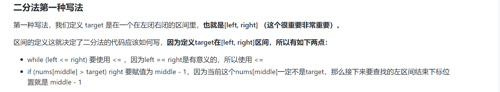
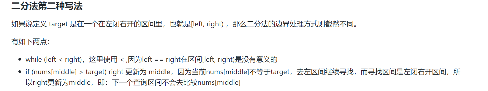

## 1.数组

### 1.二分查找





给定一个 `n` 个元素有序的（升序）整型数组 `nums` 和一个目标值 `target` ，写一个函数搜索 `nums` 中的 `target`，如果目标值存在返回下标，否则返回 `-1`。


**示例 1:**

```
输入: nums = [-1,0,3,5,9,12], target = 9
输出: 4
解释: 9 出现在 nums 中并且下标为 4
```

**示例 2:**

```
输入: nums = [-1,0,3,5,9,12], target = 2
输出: -1
解释: 2 不存在 nums 中因此返回 -1
```


**提示：**

1. 你可以假设 `nums` 中的所有元素是不重复的。
2. `n` 将在 `[1, 10000]`之间。
3. `nums` 的每个元素都将在 `[-9999, 9999]`之间。

Related Topics

数组

二分查找

```java
public int search1(int[] nums, int target) {//此方法用的是闭区间方法[left,right]
    int left = 0;
    int right = nums.length - 1;//因为是右闭区间，所以右边要减一
    while (left <= right){
        int mid = left + ( right - left ) >> 2;//除法建议使用！
        if (nums[mid] == target){
            return mid;
        }else if (nums[mid] > target){
            right = mid -1;//因为是右闭区间做法所以需要减一
        }else {
            left = mid + 1;//因为是左闭区间做法所以需要加一
        }
    }
    return -1;
}
public int search2(int[] nums, int target) {//此方法用的是左闭右开区间方法[left,right）
   int left = 0;
   int right = nums.length;//因为是右开区间，所以不需要减一
   while (left < right){
       int mid = left + (( right - left ) >> 1);//除法建议使用！
       if (nums[mid] == target){
           return mid;
       }else if (nums[mid] > target){
           right = mid;//因为是右开区间做法所以不需要减一
       }else {
           left = mid + 1;//因为是左闭区间做法所以需要加一
       }
   }
   return -1;
}
```


给定一个按照升序排列的整数数组 `nums`，和一个目标值 `target`。找出给定目标值在数组中的开始位置和结束位置。

如果数组中不存在目标值 `target`，返回 `[-1, -1]`。

**进阶：**

- 你可以设计并实现时间复杂度为 `O(log n)` 的算法解决此问题吗？


**示例 1：**

```
输入：nums = [5,7,7,8,8,10], target = 8
输出：[3,4]
```

**示例 2：**

```
输入：nums = [5,7,7,8,8,10], target = 6
输出：[-1,-1]
```

**示例 3：**

```
输入：nums = [], target = 0
输出：[-1,-1]
```


**提示：**

- `0 <= nums.length <= 105`
- `-109 <= nums[i] <= 109`
- `nums` 是一个非递减数组
- `-109 <= target <= 109`

Related Topics

数组

二分查找

```java
public int[] searchRange(int[] nums, int target) {
    int left = binarySearch(nums, target,true);//>=闭区间所以不用减一
    int right = binarySearch(nums, target,false) - 1;
    if (left <= right && right < nums.length && nums[left] == target && nums[right] == target){//>时开区间，所以需要减一
        return new int[]{left,right};
    }
    return new int[]{-1,-1};
}
public int binarySearch(int[] nums,int target,boolean status){
    int left = 0;
    int right = nums.length - 1;
    int ans = nums.length;
    while(left <= right){
        int mid = left + ((right - left) >>1);
        if (nums[mid] > target || (status && nums[mid] >= target)){//为true时,找到num[mid] >=target的边界值，为false时，找到num[mid] > target的边界值
            right = mid - 1;
            ans = mid;
        }else {
            left = mid + 1;
        }
    }
    return ans;
}
```
